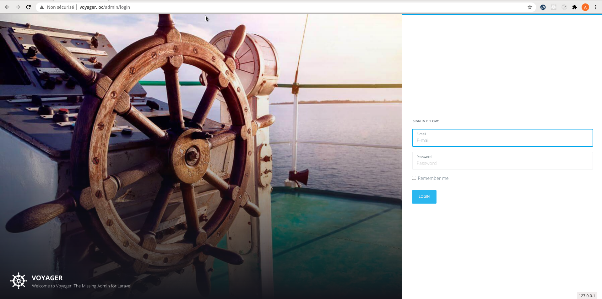
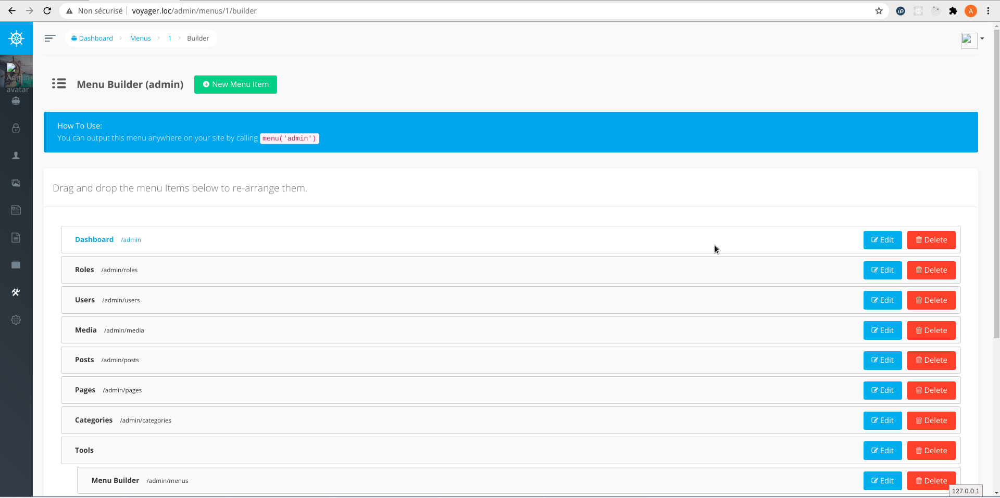
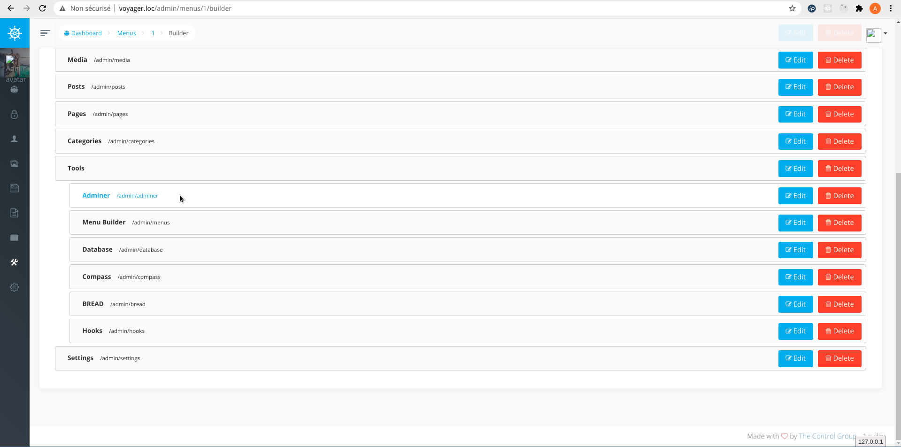
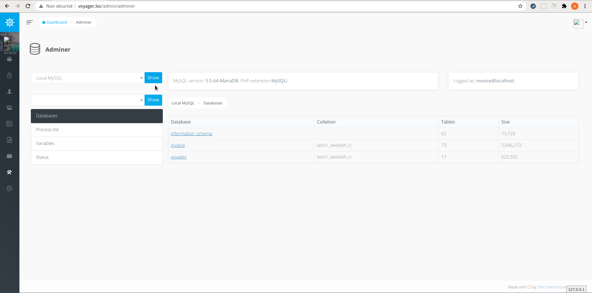
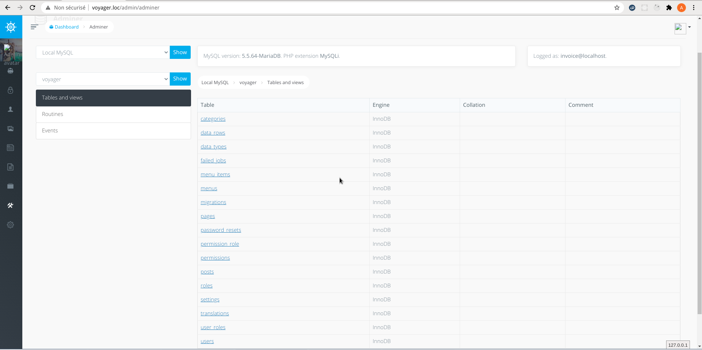

### Mise à jour du 25/01/2022

**le package [Jaxon Adminer](https://github.com/lagdo/jaxon-adminer) est désormais obsolète, et remplacé par [Jaxon DbAdmin](https://github.com/lagdo/jaxon-dbadmin).**

**Lire l'article mis à jour sur comment [installer Jaxon DbAdmin dans Voyager](../../../2022/01/installer-jaxon-dbadmin-dans-voyager.html).**

Les deux applications web en PHP les plus populaires pour administrer des bases de données sont [phpMyAdmin](https://www.phpmyadmin.net/) et [Adminer](https://www.adminer.org/). Les deux sont des applications à installer sur un serveur web.

Les packages Jaxon offrent un autre choix, [Jaxon Adminer](https://github.com/lagdo/jaxon-adminer), qui intègre un outil d'administration de bases de données dans une page d'une application web PHP existante.
Cette solution s'appuie sur [Adminer](https://www.adminer.org/), et à terme offrira donc les mêmes fonctionnalités.

#### Qu'est-ce que Adminer

[Adminer](https://www.adminer.org/) (anciennement phpMinAdmin) est un outil de gestion de base de données complet écrit en PHP.
À l'inverse de [phpMyAdmin](https://www.phpmyadmin.net/), il se compose d'un seul fichier prêt à être déployé sur le serveur cible.
`Adminer` est disponible pour `MySQL`, `MariaDB`, `PostgreSQL`, `SQLite`, `MS SQL`, `Oracle`, `Elasticsearch`, `MongoDB` et autres via des plugins.

#### Qu'est-ce que Jaxon Adminer

A l'inverse de `Adminer` qui est une application autonome, `Jaxon Adminer` est un [package](../../../../docs/v3x/plugins/packages.html) qui permet d'intégrer les fonctions de `Adminer` dans une application PHP existante. Elles sont alors accessibles dans une page de l'application, dont le contenu est mis à jour avec des requêtes ajax générées par `Jaxon`.
Cela signifie que les fonctions de gestion des accès (authentification et sécurité) sont supprimées du package, qui s'appuie désormais sur celles de l'application qui l'héberge.

#### Qu'est-ce que Voyager

Il peut arriver que des utilisateurs n'aient pas à leur disposition une application PHP pour y intégrer `Jaxon Adminer`.
Ils ont alors besoin d' installer une application complète.
Il est possible dans ce cas d'intégrer `Jaxon Adminer` dans l'un des nombreux packages d'administration PHP disponibles.

Dans cet article, nous avons choisi [Voyager](https://voyager-docs.devdojo.com), parce qu'il est gratuit, utilise le framework [Laravel](https://laravel.com) pour lequel un [plugin Jaxon](https://github.com/jaxon-php/jaxon-laravel) existe, et le framework CSS [Bootstrap 3](https://getbootstrap.com/docs/3.4/), qui est également utilisé dans `Jaxon Adminer`.

#### Installer Laravel et Voyager

Bien que cet article décrive l'installation de `Jaxon Adminer` dans `Voyager`, les principales étapes sont les mêmes pour l'installer dans d'autres environnements.
1. Installer les packages `Jaxon`,
2. Créer la page qui va contenir `Jaxon Adminer`,
3. Ajouter une route et une entrée de menu vers cette page,
4. Configurer `Jaxon` et ses packages, dont `Jaxon Adminer`.

Pour commencer, on va installer `Voyager` sur la dernière version de `Laravel`, en [suivant sa documentation](https://voyager-docs.devdojo.com/getting-started/installation).
```bash
composer create-project laravel/laravel voyager
cd voyager
composer require tcg/voyager
```

Après avoir défini les paramètres d'accès à la base de données dans le fichier `.env`, il faut finaliser l'installation, et créer un compte d'admin.
```bash
php artisan voyager:install
php artisan voyager:admin your@email.com --create
```

Il est alors possible de se connecter à `Voyager`.

[](./voyager-login.png)

#### Installer les packages Jaxon

En plus du package `lagdo/jaxon-adminer`, nous allons installer les packages `jaxon-php/jaxon-laravel`, pour l'intégration avec `Laravel`, et `jaxon-php/jaxon-dialogs` pour l'affichage des dialogues.

```bash
composer require lagdo/jaxon-adminer jaxon-php/jaxon-laravel jaxon-php/jaxon-dialogs
```

La commande `php artisan route:list | grep jaxon` affiche désormais la ligne suivante, qui montre qu'une route a été ajoutée pour traiter les requêtes `Jaxon`.
```
| Domain | Method | URI     | Name    | Action                                                     | Middleware
+--------+--------+---------+---------+------------------------------------------------------------+-----------
|        | POST   | jaxon   | jaxon   | Jaxon\Laravel\Http\Controllers\JaxonController@process     | web
```

#### Créer une page pour Jaxon Adminer

Pour afficher la page `Jaxon Adminer`, nous allons ajouter un contrôleur, une vue et une route dans `Laravel`.

Le contrôleur `app/Http/Controllers/JaxonController.php` affiche la vue, en lui passant les codes HTML, CSS et javascript de `Jaxon` et `Adminer`.
Il appelle également la méthode `ready()` du package `Jaxon Adminer`, pour indiquer que le package doit être initialisé dans cette page.
```php
namespace App\Http\Controllers;

use Jaxon\Laravel\Jaxon;
use Lagdo\Adminer\Package as Adminer;

class JaxonController extends Controller
{
    public function adminer(Jaxon $jaxon)
    {
        // Set the Adminer package as ready
        $adminer = $jaxon->package(Adminer::class);
        $adminer->ready();

        // Print the page
        return view('adminer', [
            'jaxonCss' => $jaxon->css(),
            'jaxonJs' => $jaxon->js(),
            'jaxonScript' => $jaxon->script(),
            'pageTitle' => "Adminer",
            // Adminer home
            'pageContent' => $adminer->getHtml(),
        ]);
    }
}
```

La vue `resources/views/adminer.blade.php` étend le template `voyager:master`, et insère les codes HTML, CSS et javascript de `Jaxon` et `Adminer` dans la page.


[//]: <> (La commande raw empêche l'interprétation des tags {{ et }} dans le code, qui fait planter Grav.)
```php
@extends('voyager::master')

@section('page_title', $pageTitle)

@section('css')
    <meta name="csrf-token" content="{{ csrf_token() }}">
{!! $jaxonCss !!}
@stop

@section('page_header')
    <h1 class="page-title"><i class="voyager-data"></i>{{ $pageTitle }}</h1>
@stop

@section('content')
    <div class="page-content container-fluid">
{!! $pageContent !!}
    </div>
@stop

@section('javascript')
    <script>
        $('document').ready(function () {
            $('.toggleswitch').bootstrapToggle();
        });
    </script>
{!! $jaxonJs !!}
{!! $jaxonScript !!}
@stop
```


La route est définie à la suite de celles de `Voyager`, avec le middleware fourni par `Voyager`.

```php
use App\Http\Controllers\JaxonController;

Route::group(['prefix' => 'admin'], function () {
    Voyager::routes();
    Route::get('/adminer', JaxonController::class . '@adminer')
        ->name('jaxon.adminer')->middleware('admin.user');
});
```

Le nom de cette route sera utilisé dans le `Menu Builder` de `Voyager`, comme décrit dans le paragraphe suivant.

#### Créer un menu Adminer dans Voyager

`Voyager` fournit un `Menu Builder`, que nous allons utiliser pour ajouter une entrée pour `Adminer`.
Il se lance à partir du menu `Tools > Menu Builder`. Le bouton `Builder` de la ligne `admin` donne accès à la page suivante, qui permet de définir les menus.

[](./voyager-menu-builder.png)

A partir du bouton `New Menu Item`, on va ajouter un nouveau menu avec les attributs suivants:
- Title: Adminer
- Type: Dynamic Route
- Route: jaxon.adminer
- Route parameters: (vide)
- Icon: voyager-data

On peut ensuite déplacer le menu à sa guise, par exemple sous la section `Tools`.

Après avoir rechargé la page du `Menu Builder`, le lien `/admin/adminer` s'affiche alors dans l'entrée du menu `Adminer`.

[](./voyager-menu-adminer.png)

#### Configuration de Jaxon

Le fichier `config\jaxon.php` définit la configuration de la librairie `Jaxon` et de tous ses plugins et packages.

```php
return [
    'app' => [
        'packages' => [
            Lagdo\Adminer\Package::class => [
                'servers' => [
                    'local' => [
                        'name' => 'Local MySQL',
                        'driver' => 'mysql',
                        'host' => env('DB_HOST'),
                        'port' => env('DB_PORT'),
                        'username' => env('DB_USERNAME'),
                        'password' => env('DB_PASSWORD'),
                    ],
                ],
                'default' => 'local',
            ],
        ],
    ],
    'lib' => [
        'core' => [
            'language' => 'en',
            'encoding' => 'UTF-8',
            'request' => [
                'csrf_meta' => 'csrf-token',
            ],
            'prefix' => [
                'class' => '',
            ],
            'debug' => [
                'on' => false,
                'verbose' => false,
            ],
            'error' => [
                'handle' => false,
            ],
        ],
        'js' => [
            'lib' => [
                // 'uri' => '/jaxon/lib',
            ],
            'app' => [
                // 'uri' => '',
                // 'dir' => '',
                'export' => false,
                'minify' => false,
            ],
        ],
        'dialogs' => [
            'default' => [
                'modal' => 'bootstrap',
                'message' => 'noty',
                'question' => 'noty',
            ],
            'toastr' => [
                'options' => [
                    'closeButton' => true,
                    'positionClass' => 'toast-top-center'
                ],
            ],
            'assets' => [
                'include' => [
                    'all' => true,
                ],
            ],
        ],
    ],
];
```

L'option `lib.core.request.csrf_meta` met en place la [protection CSRF de Laravel](https://laravel.com/docs/8.x/csrf) sur les requêtes `Jaxon`.

La section `lib.dialogs` définit les paramètres du package [jaxon-dialogs](https://github.com/jaxon-php/jaxon-dialogs).

L'option `servers` dans la section `app.packages.Lagdo\Adminer\Package` définit la liste des serveurs à gérer.
Dans notre cas, on gère uniquement le serveur sur lequel la base de données de `Voyager` a été créée.
L'option `default` indique le serveur dont il faut afficher le contenu dès le chargement de la page.

L'installation de `Jaxon Adminer` dans `Voyager` est maintenant terminée.
La page ci-dessous s'affiche lorsqu'on y accède.

[](./voyager-adminer-server.png)

On peut par exemple voir le contenu de la base de données de `Voyager`.

[](./voyager-adminer-database.png)
