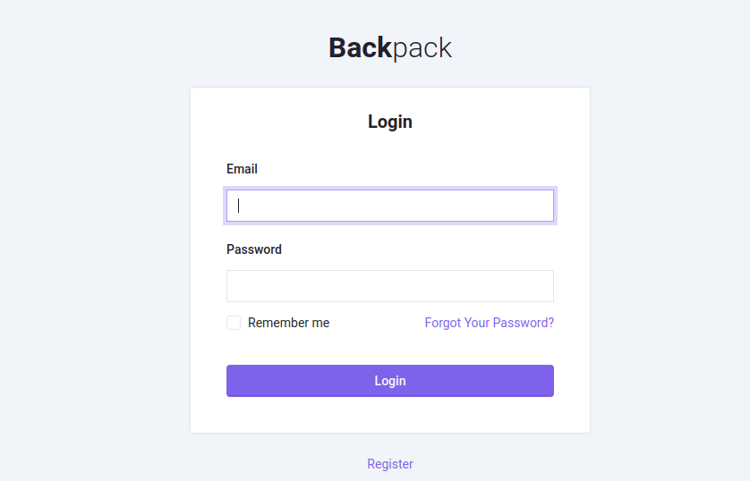
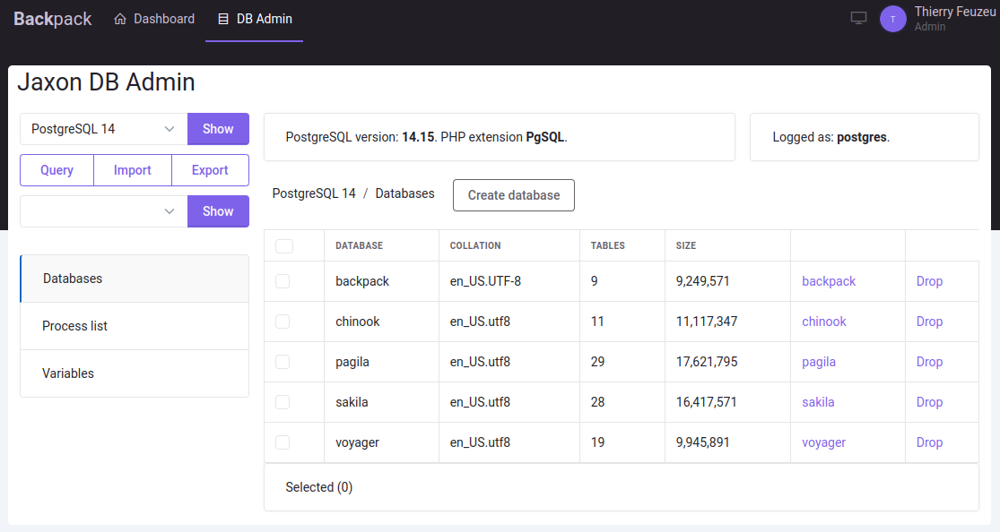
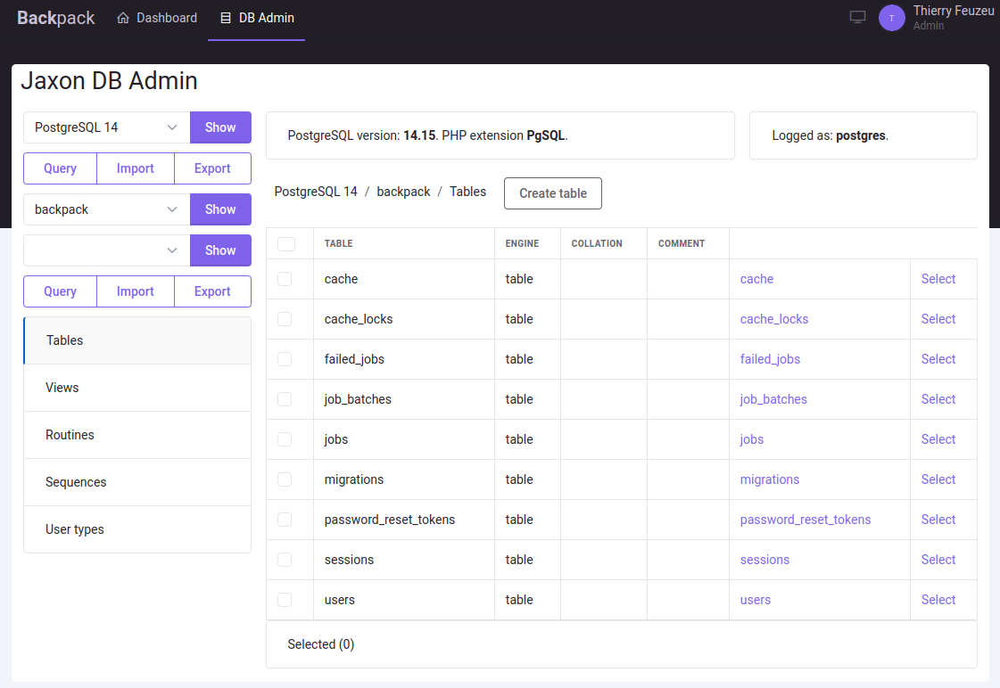

*Note: This blog entry is an update of a [previous article](../../../2022/01/install-jaxon-adminer-on-voyager.html) we wrote about how to install the `Jaxon DbAdmin` package on `Voyager`.*
*Meanwhile, the development of [Voyager](https://github.com/thedevdojo/voyager) was discontinued, so we decided to move to another admin panel.*

*This article describes the installation on [Backpack](https://backpackforlaravel.com), a Laravel-based admin panel.*

The two most popular PHP web applications for database administration are [phpMyAdmin](https://www.phpmyadmin.net/) and [Adminer](https://www.adminer.org/). Both are standalone applications that need to be installed on a web server.

The Jaxon library offers another choice, [Jaxon DbAdmin](https://github.com/lagdo/jaxon-dbadmin), which inserts a database administration tool into a page of an existing PHP web application.

#### What is Adminer

[Adminer](https://www.adminer.org/) (formerly phpMinAdmin) is a full-featured database management tool written in PHP. Unlike phpMyAdmin, it consist of a single file ready to deploy to the target server. `Adminer` is available for `MySQL`, `MariaDB`, `PostgreSQL`, `SQLite`, `MS SQL`, `Oracle`, `Elasticsearch`, `MongoDB` and others via plugin.

#### What is Jaxon DbAdmin

`Jaxon DbAdmin` results from the fork and redesign of the [Adminer](https://www.adminer.org/) core features into several [Composer packages](https://github.com/lagdo/dbadmin-mono), and the integration of the [Jaxon library](https://www.jaxon-php.org).

Unlike `Adminer` which is a standalone application, `Jaxon DbAdmin` is a [Jaxon package](../../../../docs/v5x/extensions/packages.html), which allows the user to integrate the database management features into an existing PHP application. Jaxon DbAdmin is therefore available in a page of the application, whose content is updated with ajax requests generated by `Jaxon`.

As a additional consequence, the authentication and security features are removed from the package, which will then rely on those provided by the application it is installed on.

> **Note** Jaxon DbAdmin is still a work in progress, and is not yet ready for production.

#### What is Backpack

[Backpack](https://backpackforlaravel.com) is a flexible admin panel for Laravel, that exists since 2016.
Because it keeps things simple, it is widely regarded as being both easy to learn and easy to customize.

In addition to Laravel, it is built on the [Bootstrap 5](https://getbootstrap.com) CSS framework, which is supported by the [UI library](https://github.com/lagdo/ui-builder-bootstrap5) used by `Jaxon DbAdmin`.

#### Install Laravel and Backpack

Althougth this article describes the installation of `Jaxon DbAdmin` on `Backpack`, the main steps are the same for the installation on others environments.

1. Install the Jaxon packages,
2. Create the page that will display the `Jaxon DbAdmin` dashboard,
3. Add a route and a menu entry for this page,
4. Configure `Jaxon` and its packages, among which `Jaxon DbAdmin`.

First, we will install `Backpack` on the version 12 of `Laravel`, [following its documentation](https://backpackforlaravel.com/docs/6.x/installation).

```bash
composer create-project laravel/laravel backpack 12.x
cd backpack
composer require backpack/crud
```

After we have defined the database access parameters in the `.env` file, we can take the final step of the installation and create an admin account.

```bash
php artisan backpack:install
```

This command will ask for information to create an admin account, and also to choose a theme.
We have chosen [Tabler](https://github.com/laravel-backpack/theme-tabler/), a Bootstrap 5 template.

After the command has completed, we can login on Backpack, on the `/admin` path in the installed application.

[](./backpack-login.png)

#### Install the Jaxon packages

In addition to the `lagdo/jaxon-dbadmin` package, we need to install the `jaxon-php/jaxon-laravel` package, for integration with `Laravel`, the framework `Backpack` is built with.

For the database drivers, we need to install the `lagdo/dbadmin-driver-mysql`, `lagdo/dbadmin-driver-pgsql` or `lagdo/dbadmin-driver-sqlite` packages, depending on the databases that need to be managed.

Finally, we need to install packages for the UI. At the time this article is published, only the [package for `Bootstrap`](https://github.com/lagdo/ui-builder-bootstrap) is available.

> **Note** Some of the packages to be installed are still being actively developed. So we need to set the `minimum-stability` value to `dev` in the `composer.json` file, and install those packages from the `dev-main` branch.

```bash
composer require jaxon-php/jaxon-laravel jaxon-php/jaxon-dialogs jaxon-php/jaxon-upload
composer require lagdo/jaxon-dbadmin:dev-main lagdo/dbadmin-driver-mysql:dev-main lagdo/dbadmin-driver-pgsql:dev-main lagdo/dbadmin-driver-sqlite:dev-main
composer require lagdo/ui-builder-bootstrap5:dev-main
```

The `php artisan route:list | grep jaxon` command now prints the following line, showing that a route exists for `Jaxon` requests.
Thanks to the Laravel package discovery feature.

```
  POST       jaxon ... (more dots) ... jaxon.ajax
```

#### Create a page for Jaxon DbAdmin

We are now going to add a route and a view that will display the `Jaxon DbAdmin` page.
The Backpack admin panel really makes those tasks very easy.

The `resources/views/admin/dbadmin.blade.php` view extends the `blank` template, and inserts the HTML, CSS and javascript codes of `Jaxon DbAdmin` in the page.
The [Font Awesome](https://fontawesome.com) icon set is also added, because it is used in the Jaxon DbAdmin UI.

```php

@extends(backpack_view('blank'))

@push('after_styles')
    <link rel="stylesheet" href="//use.fontawesome.com/releases/v5.15.4/css/all.css">

    @jxnCss
@endpush

@push('after_scripts')
    @jxnJs

    @jxnScript
@endpush

@section('content')
<div style="margin:0 -10px; padding:5px; background-color:white; border-radius:5px;">
    <div style="margin-left:5px">
        <h2>Jaxon DB Admin</h2>
    </div>
    <div>
        {!! jaxon()->package(Lagdo\DbAdmin\Package::class)->getHtml() !!}
    </div>
</div>
@endsection

```

The route is added in the `routes/backpack/custom.php` file, where custom routes are defined.

```php
Route::group([
    'prefix' => config('backpack.base.route_prefix', 'admin'),
    'middleware' => array_merge(
        (array) config('backpack.base.web_middleware', 'web'),
        (array) config('backpack.base.middleware_key', 'admin')
    ),
    'namespace' => 'App\Http\Controllers\Admin',
], function () { // custom admin routes
    // Jaxon DbAdmin route
    Route::get('dbadmin', fn() => view('admin.dbadmin'))
        ->middleware('jaxon.config')
        ->name('dbadmin');
}); // this should be the absolute last line of this file
```

The route displays the view, after having called a middleware to setup the Jaxon library.

Now we can create a menu entry for Jaxon DbAdmin, by adding the following content in the `resources/views/vendor/backpack/ui/inc/menu_items.blade.php` file.

```php

<li class="nav-item">
    <a class="nav-link" href="{{ backpack_url('dbadmin') }}">
        <i class="la la-database nav-icon"></i> DB Admin
    </a>
</li>

```

#### Jaxon configuration

The last step is to define the Jaxon library config in the `config\jaxon.php` file.
This also includes the Jaxon DbAdmin package config, where the database servers to be managed are defined.

```php
return [
    'app' => [
        'request' => [
            'route' => 'jaxon.ajax', // The route name
            'middlewares' => ['web', 'auth'],
        ],
        'directories' => [],
        'packages' => [
            Lagdo\DbAdmin\Package::class => [
                // The database servers
                'servers' => [
                    'db-postgresql' => [ // A unique identifier for this server
                        'driver' => 'pgsql',
                        'name' => 'PostgreSQL 14',     // The name to be displayed in the dashboard UI.
                        'host' => 'db-postgresql',     // The database host name or address.
                        'port' => 5432,      // The database port. Optional.
                        'username' => '********', // The database user credentials.
                        'password' => '********', // The database user credentials.
                    ],
                    'db-mariadb' => [ // A unique identifier for this server
                        'driver' => 'mysql',
                        'name' => 'MariaDB 10',     // The name to be displayed in the dashboard UI.
                        'host' => 'db-mariadb',     // The database host name or address.
                        'port' => 3306,      // The database port. Optional.
                        'username' => '********', // The database user credentials.
                        'password' => '********', // The database user credentials.
                    ],
                    'db-mysql' => [ // A unique identifier for this server
                        'driver' => 'mysql',
                        'name' => 'MySQL 8',     // The name to be displayed in the dashboard UI.
                        'host' => 'db-mysql',     // The database host name or address.
                        'port' => 3306,      // The database port. Optional.
                        'username' => '********', // The database user credentials.
                        'password' => '********', // The database user credentials.
                    ],
                    'sqlite-3' => [ // A unique identifier for this server/var/www
                        'driver' => 'sqlite',
                        'name' => 'Sqlite 3',     // The name to be displayed in the dashboard UI.
                        'directory' => '/var/lib/sqlite/3', // The directory containing the database files.
                    ],
                ],
            ],
        ],
        'ui' => [
            'template' => 'bootstrap5',
        ],
        'dialogs' => [
            'default' => [
                'modal' => 'bootbox',
                'alert' => 'toastr',
                'confirm' => 'noty',
            ],
        ],
    ],
    'lib' => [
        'core' => [
            'language' => 'en',
            'encoding' => 'UTF-8',
            'prefix' => [
                'class' => '',
            ],
            'request' => [
                'csrf_meta' => 'csrf-token',
                'uri' => '/jaxon', // The route url
            ],
            'debug' => [
                'on' => false,
                'verbose' => false,
            ],
            'error' => [
                'handle' => false,
            ],
        ],
        'js' => [
            'lib' => [
                // 'uri' => '',
            ],
            'app' => [
                // 'uri' => '',
                // 'dir' => '',
                // 'export' => true,
                // 'minify' => true,
            ],
        ],
    ],
];
```

The `lib.core.request.csrf_meta` option adds [Laravel CSRF protection](https://laravel.com/docs/12.x/csrf) on `Jaxon` requests.
The `app.ui.template` defines the UI library to use, here `bootstrap5`.
The `app.dialogs` section defines the libraries to use for [dialogs](../../../../docs/v5x/ui-features/dialogs.html).
The `servers` option in the `app.packages.Lagdo\DbAdmin\Package` section defines the list of servers to be managed.
The Jaxon request route access is also protected with the Laravel auth middleware.

> **Note** The database credentials can be moved to the .env file.

The installation of `Jaxon DbAdmin` on `Backpack` has now been completed.
The above image shows how the page is displayed to the user.

[](./backpack-dbadmin-server.png)

The user can for example browse the content of the `Backpack` database.

[](./backpack-dbadmin-database.png)
