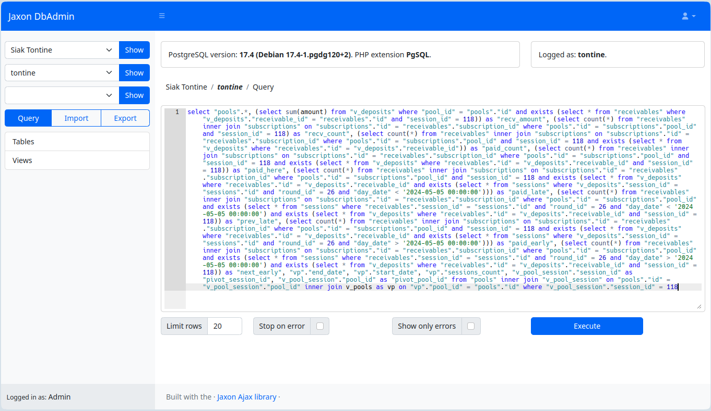

Les développeurs ont souvent besoin d'un accès direct aux bases de données utilisées par les applications sur lesquelles ils travaillent, ceci dans pratiquement tous les environnements d'un projet: développement, test, pré-production, et parfois même en production.

Ils utilisent pour cela des logiciels tels que [Adminer](https://www.adminer.org/), [PhpMyAdmin](https://www.phpmyadmin.net/), [DBeaver](https://dbeaver.io/), et bien d'autres, qui ont la particularité d'authentifier leurs utilisateurs avec les paramètres d'accès aux bases de données.
Ceci pousse les administrateurs de bases de données dans les entreprises à partager avec les développeurs les identifiants et les mots de passe d'accès, ce qui dans le meilleur des cas se fait des logiciels de type `password manager`.

Ce partage des informations de connexion peut poser un certain nombre de risques.
Des fuite accidentelles d'informations sensibles, si un développeur partage par mégarde ces données avec des tiers.
La réutilisation des identifiants dans des environnements inappropriés.
Des accès non contrôlés et non tracés, à cause du partage de ces informations entre plusieurs développeurs.
Des accès à des personnes non autorisées, lorsque des développeurs quittent l'entreprise.

Il va être difficile de faire respecter les bonnes pratiques de sécurité dans ces conditions.

### Jaxon DbAdmin

**Jaxon DbAdmin** est une application web de gestion de bases de données qui apporte une approche différente à l'authentification des utilisateurs et la connexion aux bases de données.

L'application gère séparément l'authentification de ses utilisateurs et les connexions aux bases de données, dont les paramètres sont stockés uniquement dans son fichier de configuration sur le serveur.

Lorsqu'un utilisateur se connecte, **Jaxon DbAdmin** lit dans sa configuration la liste des bases de données auxquelles il a accès et la lui présente.
Et lorsque l'utilisateur effectue une action sur une base de données, **Jaxon DbAdmin** lit dans sa configuration les identifiants de connexion correspondants, exécute l'action et lui renvoie le résultat.
Ainsi, l'utilisateur accède aux bases de données sans avoir accès aux identifiants de connexion.

Notons que cette technique d'accès aux bases de données n'est pas vraiment nouvelle.
D'une part, les applications qui utilisent des bases de données stockent déjà de cette façon les identifiants de connexion, et d'autre part, il existe déjà des applications de gestion de bases de données qui authentifient leurs utilisateurs ailleurs que sur les bases de données.
**Jaxon DbAdmin** combine ces deux approches pour en faire son fonctionnement par défaut.

**Jaxon DbAdmin** est un logiciel open source distribué sous licence BSD-3-Clause: [https://github.com/lagdo/dbadmin-app](https://github.com/lagdo/dbadmin-app).
Une image Docker est également fournie: [https://hub.docker.com/r/lagdo/jaxon-dbadmin](https://hub.docker.com/r/lagdo/jaxon-dbadmin).

> **Jaxon DbAdmin** est toujours activement développée, et certaines fonctions ne sont pas encore disponibles.

### Les avantages

Le stockage des identifiants de connexion sur un serveur renforce la sécurité.
Les développeurs ne peuvent pas copier, transférer ou exposer les identifiants, même par erreur.
Chaque requête peut être liée à un utilisateur ou à un rôle spécifique, ce qui permet d’auditer facilement qui a fait quoi, et quand.
Les identifiants de connexion ne sont plus disséminés sur les postes de développement, dans des fichiers de configuration, dans des emails ou autres outils de communication. Ils peuvent même être sécurisés dans un coffre-fort (vault).

La configuration des connexions est désormais gérée au niveau de la plateforme ou de l'infrastructure, et non du code de l'application. Cela facilite la gestion des environnements (dev, staging, prod).
Puisque les utilisateurs n'ont pas les identifiants, on peut les changer régulièrement sans perturber les applications ou les développeurs.
De même, si les identifiants sont compromis, l'administrateur n'aura pas à les changer sur les postes des développeurs. Cela se fait à un seul endroit, de façon transparente pour les applications et les utilisateurs.

On aura également une meilleure gestion des autorisations selon le principe du moindre privilège : chaque utilisateur n’accède qu’à ce dont il a besoin, indépendamment des identifiants réellement utilisés.
En cas de départ d'un développeur, il suffit de révoquer son accès à l'application, sans avoir à modifier le mot de passe de la base de données et à impacter toutes les autres applications et personnes.

Enfin, de nombreuses normes de sécurité exigent une gestion stricte des accès aux données.
Ne pas partager les identifiants d'accès aux bases de données facilite le respect de ces exigences.

### Les challenges

Malgré les avantages ci-dessus, l'utilisation des outils existants qui offrent une authentification séparée n'est pas assez courante car elle se heurte à plusieurs challenges.

Mettre en place et utiliser un système de gestion des secrets (vault) ou une API Gateway avec les permissions nécessaires est complexe. Pour une petite équipe ou sur certains projets, cela représente une surcharge importante en termes de temps, de compétences et de budget.
D'un autre côté, les outils tels que [DBeaver](https://dbeaver.io/) (Community) et [Adminer](https://www.adminer.org/) sont gratuits et open-source.

Certaines tâches complexes (analyser des indexes, optimiser des requêtes, faire des exports/imports massifs) sont beaucoup plus simples avec un outil graphique qu'avec une ligne de commande ou une API REST.
Il en est de même de l'analyse de la structure d'une base de données complexe avec de nombreuses tables.
La convivialité de l'interface graphique des outils comme [DBeaver](https://dbeaver.io/) ou [Adminer](https://www.adminer.org/) est un avantage certain.

Les développeurs expérimentés aiment parfois avoir la main directe sur la base.
Ils apprécient la rapidité d'une requête SQL _ad hoc_ pour explorer un schéma de base de données, comprendre les relations entre les tables, ou tester une logique complexe avant de l'écrire dans le code.
Pour des manipulations ponctuelles, se connecter avec un outil graphique leur semble plus rapide.

Il est difficile de reproduire un environnement où l'accès direct à la base de données est interdit sur un poste de développement.
Les développeurs ont alors besoin d'une base de données locale pour coder, et dans ce cas la sécurité des accès n'est pas une priorité.
[Adminer](https://www.adminer.org/) ou [DBeaver](https://dbeaver.io/) conviennent très bien à cette situation, et la tentation est grande d'utiliser le même outil pour tous les environnements.

Beaucoup de développeurs ont toujours travaillé avec des accès directs à la base de données.
Dans de nombreuses entreprises, partager les identifiants d'accès aux bases de données est une pratique historique et culturellement ancrée. Changer cela nécessite de modifier les processus et les mentalités.
De plus, tous les développeurs ne sont pas conscients des risques ou des meilleures pratiques alternatives.

### En conclusion

**Jaxon DbAdmin** est une application web de gestion de bases de données qui sépare l'authentification des utilisateurs et les connexions aux bases de données, dont les identifiants ne sont donc pas partagés avec les utilisateurs qui y accèdent.
Sa configuration permet à l'administrateur de définir les identifiants correspondant à chaque utilisateur ou chaque groupe d'utilisateurs.

Il va donc permettre d'améliorer la sécurité des accès aux bases de données, tout en conservant la convivialité et la simplicité d'une interface graphique.

Son code provient de [celui d'Adminer](https://github.com/vrana/adminer/), qui a été refactorisé et modernisé. Bien que son UI ait également été modernisé, il offre des fonctions similaires à [Adminer](https://www.adminer.org/).

Cependant, **Jaxon DbAdmin** est toujours activement développé, et certaines fonctions ne sont pas encore disponibles.
