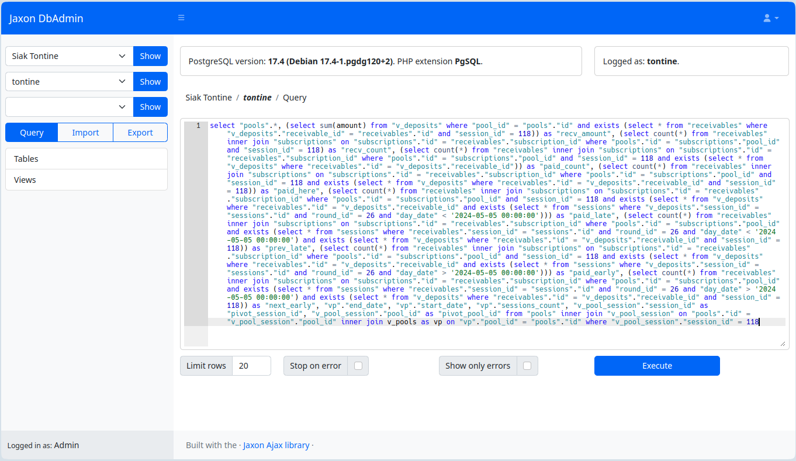

Developers often need direct access to the databases used by the applications they work on, in virtually every environment of a project: development, testing, pre-production, and sometimes even in production.

To do this, they use software such as [Adminer](https://www.adminer.org/), [PhpMyAdmin](https://www.phpmyadmin.net/), [DBeaver](https://dbeaver.io/), and many others, which share a common feature: they authenticate their users with database access parameters.
This pushes teams within companies to share database access credentials with developers, which, in the best-case scenario, is done with a `password manager` software.

This sharing of database credentials can pose several risks.
Accidental leaks of sensitive information, if a developer inadvertently shares this data with third parties.
Reuse of credentials in inappropriate environments.
Uncontrolled and untraceable access, due to the sharing of this information with multiple developers.
Access by unauthorized individuals, when developers leave the company.

Enforcing good security practices under these conditions will be difficult.

### Jaxon DbAdmin

**Jaxon DbAdmin** is a web-based database management application that takes a different approach to user authentication and database connection.

The application clearly separates the authentication of its users and the connections to databases. The parameters of the later are stored only in its configuration file on the server.

When a user logs in, **Jaxon DbAdmin** reads the list of databases he has access to from its configuration and presents it to him.
And when the user performs an action on a database, **Jaxon DbAdmin** reads the corresponding database credentials from its configuration, executes the action, and returns the result.
This allows the user to access the database contents without having access to the database credentials.

It's worth noting that this database access technique isn't exactly new.
First, applications that use databases already store database credentials this way, and then, there are already database management applications that authenticate their users elsewhere than in the database.
**Jaxon DbAdmin** combines these two approaches to make it its default mode.

**Jaxon DbAdmin** is an open source software distributed under the BSD-3-Clause license: [https://github.com/lagdo/dbadmin-app](https://github.com/lagdo/dbadmin-app).
A Docker image is also provided: [https://hub.docker.com/r/lagdo/jaxon-dbadmin](https://hub.docker.com/r/lagdo/jaxon-dbadmin).

> **Jaxon DbAdmin** is still being actively developed, and some features are not yet available.

### The advantages

Storing database credentials on the server only enhances security.
Developers cannot copy, transfer, or expose credentials, even by mistake.
Each request can be linked to a specific user or role, making it easy to audit who did what, and when.
Database credentials are no longer scattered across development workstations, in configuration files, emails, or other communication tools. They can even be secured in a vault.

Connection configuration is now managed at the platform or infrastructure level, not in the application code. This makes it easier to manage environments (dev, staging, production).
Since users don't have access to the database credentials, they can be changed regularly without disrupting applications or developers.
Similarly, if the credentials are compromised, the administrator won't have to change them on developer workstations. This is done in a single location, transparently for applications and users.

There will also be better permission management based on the principle of least privilege: each user only has access to what he needs, regardless of the database credentials actually used.
If a developer leaves, his access to the application can simply be revoked, without having to change the database credentials and impact all other applications and users.

Finally, many security standards require strict data access management.
Not sharing database credentials makes it easier to comply with these requirements.

### The challenges

Despite the above advantages, the use of existing tools that offer separate authentication is not common enough because they face several challenges.

Setting up and using a secrets management system (vault) or an API Gateway with the necessary permissions is complex. For a small team or on certain projects, this represents a significant overhead in terms of time, skills, and budget.
On the other hand, tools such as [DBeaver](https://dbeaver.io/) (Community) and [Adminer](https://www.adminer.org/) are free and open-source.

Certain complex tasks (analyzing indexes, optimizing queries, performing large-scale exports/imports) are much simpler with a graphical tool than with a command line or REST API.
The same is true for analyzing the structure of a complex database with many tables.
The user-friendliness of the graphical interface of tools like [DBeaver](https://dbeaver.io/) or [Adminer](https://www.adminer.org/) is an advantage.

Experienced developers sometimes like to have direct control over the database.
They appreciate the speed of an _ad hoc_ SQL query to explore a database schema, understand relationships between tables, or test complex logic before writing it in code.
For occasional manipulations, connecting with a graphical tool seems faster.

It is difficult to replicate an environment where direct access to the database is prohibited on a development workstation.
Developers then need a local database to code on, and in this case, access security isn't a priority.
[Adminer](https://www.adminer.org/) or [DBeaver](https://dbeaver.io/) are ideal for this, and the temptation is great to use the same tool for all environments.

Many developers have always worked with direct database access.
In many companies, sharing database access credentials is a historical and culturally entrenched practice. Changing this requires shifting processes and mindsets.
Furthermore, not all developers are aware of the risks or alternative best practices.

### In conclusion

**Jaxon DbAdmin** is a web-based database management application that separates user authentication and database connections, meaning that database credentials are not shared with users accessing the database contents.
Its configuration allows the administrator to define credentials for each user or group of users.

It will therefore improve the security of access to databases, while maintaining the user-friendliness and simplicity of a graphical interface.

Its code comes [from Adminer](https://github.com/vrana/adminer/), which has been refactored and modernized. Although its UI has also been modernized, it offers similar functions as [Adminer](https://www.adminer.org/).

However, **Jaxon DbAdmin** is still being actively developed, and some features are not yet available.
