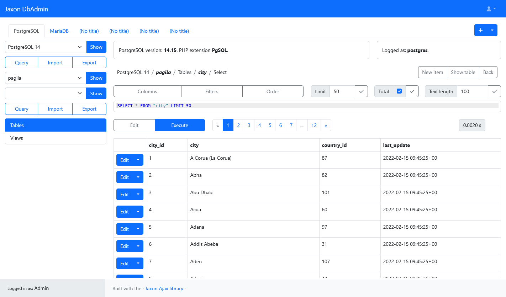
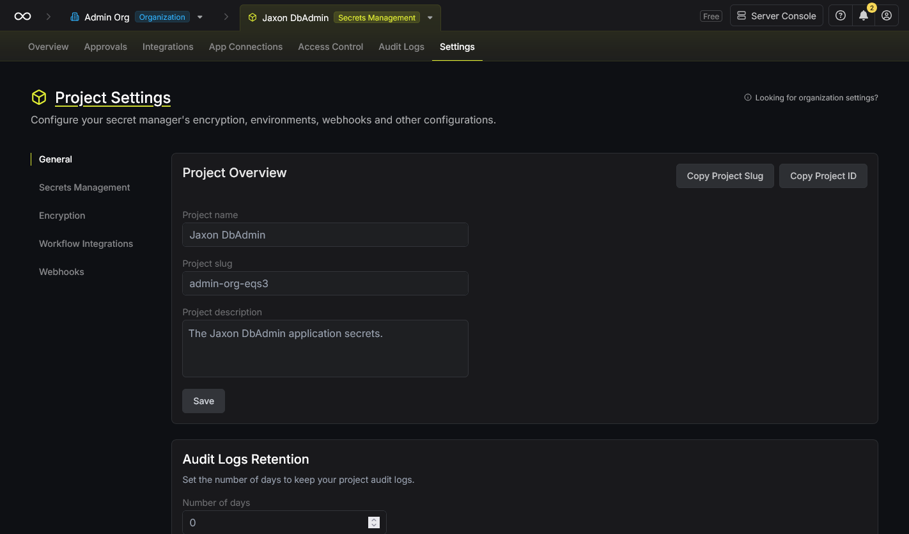
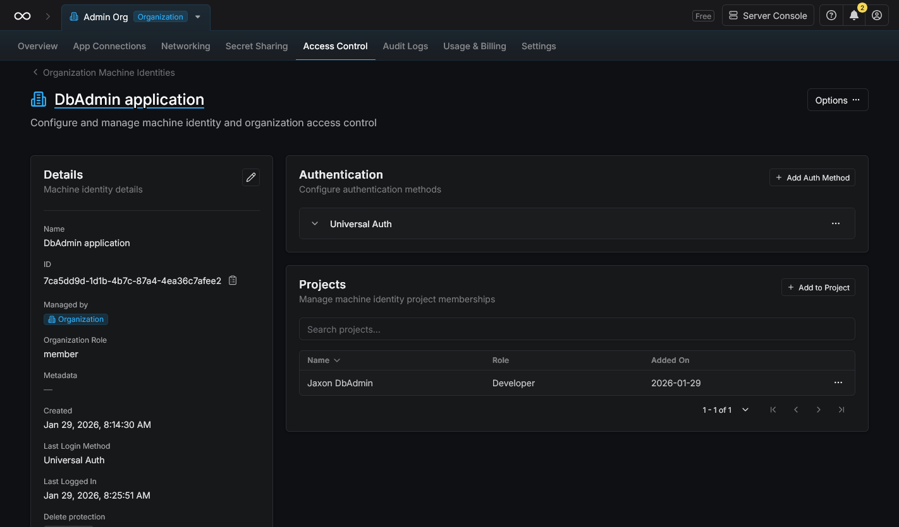
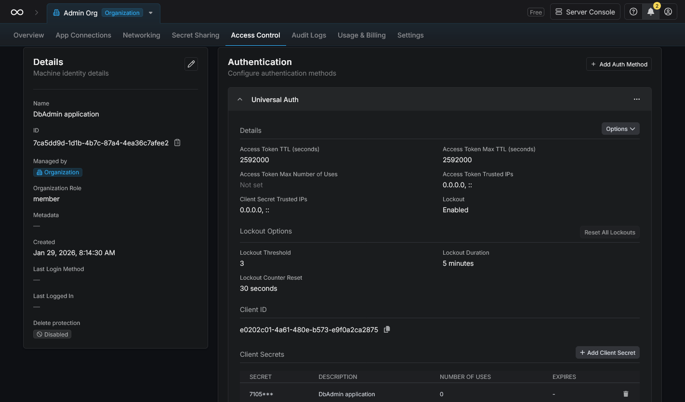
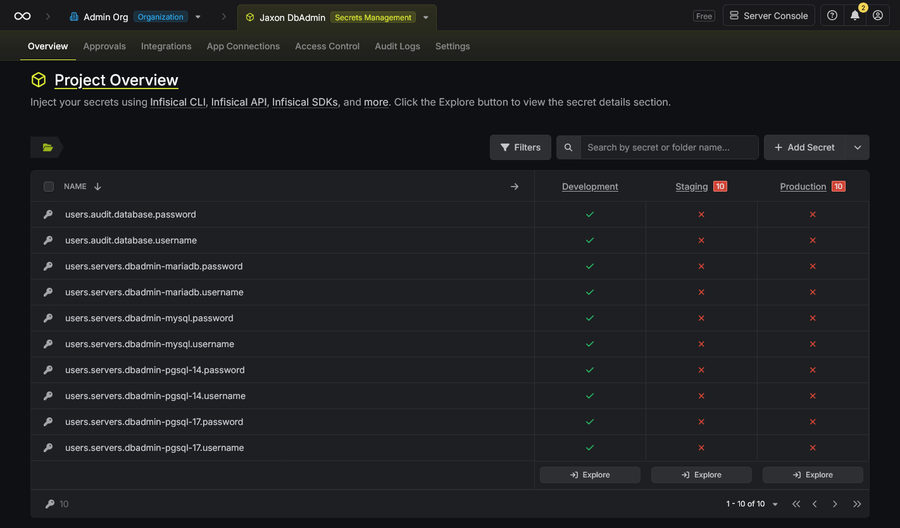

This tutorial covers the use of the [Infisical](https://infisical.com/) server with the [Jaxon DbAdmin](https://github.com/lagdo/dbadmin-app) database management tool to store the credentials of the managed databases in a secure location.

The first part covers the installation and configuration of the Jaxon DbAdmin application, while the second part covers the installation and setup of the Infisical server, and how it is used to secure the Jaxon DbAdmin application.

> **Note** While many of its feature are ready for use, Jaxon DbAdmin is still a work in progress, and is not yet ready for production.

#### What is Infisical

According to its website, [Infisical](https://infisical.com/) is a all-in-one platform to securely manage application secrets, certificates, SSH keys, and configurations across teams and infrastructures.

The feature we'll be using here is [Secrets Management](https://infisical.com/docs/documentation/platform/secrets-mgmt/overview), which allow to centralize application secrets across environments and workloads, enforce identity-based access, auditing, and secure delivery at runtime.

#### Why use Infisical with Jaxon DbAdmin

By default, Jaxon DbAdmin stores all the database credentials on the server it is installed on.
While this already brings a higher level of security compared to spreading the database credentials across the developer teams, the security can be further improved by storing the credentials in a secure location.

When managing multiple database servers or multiple Jaxon DbAdmin instances, fetching the database credentials from the Infisical server instead of providing them all when deploying the application, will make the deployment much more simple.
Moreover, the Jaxon DbAdmin application can benefit from the many advanced credentials management features provided by Infisical, like password rotation, and synchronisation with the servers.

### Install and populate the databases

In this tutorial, we'll use Docker Compose to install the applications.
Let's start by creating the databases we are going to manage.

The Docker Compose file at [https://github.com/lagdo/dbadmin-mono/tree/main/docker/compose-dbserver](https://github.com/lagdo/dbadmin-mono/tree/main/docker/compose-dbserver) will start four database servers: `PostgreSQL 14`, `PostgreSQL 17`, `MariaDB 10` and `MySQL 8`.

The `seed` container provides scripts to populate the databases with datasets freely available online.
Make sure to copy the [https://github.com/lagdo/dbadmin-mono/tree/main/docker/seed](https://github.com/lagdo/dbadmin-mono/tree/main/docker/seed) and [https://github.com/lagdo/dbadmin-mono/tree/main/jaxon-dbadmin/migrations](https://github.com/lagdo/dbadmin-mono/tree/main/jaxon-dbadmin/migrations) directories locally and update the volumes in the `docker-compose.yml` file accordingly.

Create and start the containers.

```bash
docker compose up -d
```

Now enter the `seed` container, and run the scripts in the `/home/dbadmin/scripts` directory to populate the PostgreSQL, MariaDB and MySQL databases.

The `/home/dbadmin/scripts/pgsql/auditdb.sh` script migrates the `PostgreSQL 17` server for the Jaxon DbAdmin audit logs feature.

### Install the Jaxon DbAdmin application

The Jaxon DbAdmin application is available as a Docker image at [https://hub.docker.com/r/lagdo/jaxon-dbadmin](https://hub.docker.com/r/lagdo/jaxon-dbadmin).

Before installing the application, we need some config files.

The `config/dbadmin.json` file lists the managed database servers, and defines the access per user or role.

<script src="https://gist.github.com/feuzeu/e2cf6628a649338953d76df9fd99ff33.js"></script>

In the `config/dbadmin.php` file, the audit logs are enabled and a database is defined for their storage.
The audit database is `PostgreSQL 17`, which was migrated with the `/home/dbadmin/scripts/pgsql/auditdb.sh` script.

<script src="https://gist.github.com/feuzeu/75f93a8c94288e9c607ded6839d30eea.js"></script>

> **Note** The environment variables are specified in a custom format. The `env()` function is not called directly.

With this setup, the access to the database servers and the audit logs page is granted only to the user with email `admin@company.com`.

We now define the database addresses, port numbers and credentials as environment variables in the `.env.dbadmin` file.

<script src="https://gist.github.com/feuzeu/65e009ae8f635f9d56c4b57b14004d62.js"></script>

The Jaxon DbAdmin application can now be started with the following `docker-compose.yml` file.
Make sure the config files are stored in the paths specified in this file.

<script src="https://gist.github.com/feuzeu/18b078a7e1c5ae0b0bc3c5f15bdeff4b.js"></script>

Since the database containers have exposed their port numbers, the `jaxon-dbadmin` container connects to them using the host address, as defined in the `extra_hosts` section.

The last install step is to create a user in the application.
Enter the `jaxon-dbadmin` container, and run the following command, which will prompt for the user password.

```bash
cd /var/www
php artisan user:create --name Admin --email admin@company.com
```

> **Note** This command is a [Laravel Artisan console command](https://laravel.com/docs/12.x/artisan).

Now, the Jaxon DbAdmin application is up and running, and the user can log in using the credentials provided in the above command, and browse the managed databases in multiple tabs.

[](./jaxon-dbadmin-pgsql-table.png)

### Install and setup the Infisical server

At this point, the Jaxon DbAdmin application uses the credentials stored in the `.env.dbadmin` file to connect to the database servers.
We are now going to migrate those credentials to a local instance of the [Infisical](https://infisical.com/) running with Docker.

The Docker Compose file to run the Infisical server is here: [https://github.com/lagdo/dbadmin-mono/tree/main/docker/compose-secret](https://github.com/lagdo/dbadmin-mono/tree/main/docker/compose-secret).
It is the same as [this one](https://github.com/Infisical/infisical/blob/main/docker-compose.prod.yml), with some slight changes.

After running the `docker compose up -d` command, the application can be browsed at `http://localhost:7095`.
The user is now able to create a first admin user account and connect into the dashboard.

Create a project of type `Secrets Management` for the Jaxon DbAdmin credentials, and copy its id.

[](./infisical-project-settings.png)

Create a machine identity for the DbAdmin application server, and add that new identity to the Jaxon DbAdmin project.

[](./infisical-machine-identity-project.png)

Add a secret in the `Universal Auth` window, and copy the client id and client secret id.

[](./infisical-machine-identity-auth.png)

The last step here is to create the Jaxon DbAdmin secrets.

[](./infisical-project-secrets.png)

For each database server, there is a secret for the `username` and another one for the `password`.
To keep things simple, each secret name has the same value as the corresponding option name in the Jaxon DbAdmin config, with `users.` as prefix.

### Setup the Jaxon DbAdmin for Infisical

> **Edit 2026/02/10** The `0.9.0` release of Jaxon DbAdmin now includes by default a `config reader` for Infisical. It is no more required to add and register the `InfisicalConfigReader` class in the Jaxon container as described above. Read the `Config readers` section in the [documentation](https://github.com/lagdo/dbadmin-app) for more information.

We are now going to setup the Jaxon DbAdmin application to fetch the database credentials from the Infisical server.

First update the `.env.dbadmin` file with the Infisical server URL and ids, and delete the database credentials.

<script src="https://gist.github.com/feuzeu/93f6c4707ef80fff9d691105402b6b79.js"></script>

Jaxon DbAdmin uses a configurable `config reader` class to read database credentials.
In order to be able to read those credentials from the Infisical server, we'll need to provide a custom `config reader` class.

A [default class](https://github.com/lagdo/jaxon-dbadmin/blob/main/src/Config/ConfigReader.php) is provided, which we are going to extend to implement our custom config reading feature.

<script src="https://gist.github.com/feuzeu/b65056ee1ed2c7320ff149cd3dd58095.js"></script>

The `getUsername()` and `getPassword()` functions are overridden, and now get their values from the Infisical server.

> **Note** The `$secretKey` value needs to be set according to how the secret are stored in the Infisical project. The `AuthInterface` object can also allow to return a different key depending on the user email or role.

This file will be located at `app/Infisical/InfisicalConfigReader.php`, and Jaxon DdAdmin needs to be configured to use it to read config.
So the `config/jaxon.php` file is edited with the following changes: the `App\Infisical\InfisicalConfigReader` class is defined as the `config reader`, and a new entry is added in the Jaxon DI container.
```php
    'packages' => [
        Lagdo\DbAdmin\Db\DbAdminPackage::class => [
            // Config reader definition
            'config' => [
                'reader' => InfisicalConfigReader::class,
            ],
        ],
    ],
    'container' => [
        'set' => [
            // Config reader DI
            InfisicalConfigReader::class => function(Container $di) {
                $auth = $di->g(AuthInterface::class);

                $infisicalSdk = new InfisicalSDK(env('INFISICAL_SERVER_URL'));
                $clientId = env('INFISICAL_MACHINE_CLIENT_ID');
                $clientSecret = env('INFISICAL_MACHINE_CLIENT_SECRET');
                // Authenticate on the Infisical server.
                $infisicalSdk->auth()->universalAuth()->login($clientId, $clientSecret);
                // Create the Infisical secrets service.
                $secrets = $infisicalSdk->secrets();
                $projectId = env('INFISICAL_PROJECT_ID');
                return new InfisicalConfigReader($auth, $secrets, $projectId, 'dev');
            },
        ],
    ],
```

> **Note** The `App\Infisical\InfisicalConfigReader` class can be defined in the [Laravel service container](https://laravel.com/docs/12.x/container) instead.

Here's the modified `config/jaxon.php` file.

<script src="https://gist.github.com/feuzeu/b40c2a8fb6da66b63cc5631cab875a90.js"></script>

The databases credentials can now be removed from the `config/dbadmin.json` config file.

<script src="https://gist.github.com/feuzeu/ad5bbeb50d35952aad0a2bdda9af02d9.js"></script>

This `Dockerfile` installs the [Infisical PHP SDK](https://infisical.com/docs/sdks/languages/php) in the Jaxon DbAdmin application.

<script src="https://gist.github.com/feuzeu/1475294c93fd7fd4a6863c00fe94144d.js"></script>

The new `docker-compose.yml` will now setup the Jaxon DbAdmin application to read the managed databases credentials from the local Infisical server.

<script src="https://gist.github.com/feuzeu/c23a169713485e0c1b7e9de24b5e11e8.js"></script>

Jaxon DbAdmin now runs exactly as before, but without any database username or password stored locally.

### Securing the Jaxon DbAdmin application with Infisical

While the [Infisical PHP SDK](https://infisical.com/docs/sdks/languages/php) documentation recommends to set the [machine identity tokens](https://infisical.com/docs/documentation/platform/identities/overview) as environment variables, as we did in this tutorial, the Infisical service can also secure the entire application.

A howto for the Laravel framework is provided: [https://infisical.com/docs/integrations/frameworks/laravel](https://infisical.com/docs/integrations/frameworks/laravel).
With this feature, the Infisical cli injects the environment variables and secrets into the Laravel application, Jaxon DbAdmin in our case.

The question that might arise here is why use the Jaxon DbAdmin custom `config reader` instead of the Infisical cli.
The main difference is that the Infisical cli injects all the secrets once when the application server (not the Laravel application itself) starts, while the `config reader` fetches the secrets it needs from the Infisical server on each request, and is then able to ask for or receive a different secret depending on the current application state, or the changes on the Infisical server.

So the user might choose the technique that best fits its requirements, and even use both of them simultaneously.
