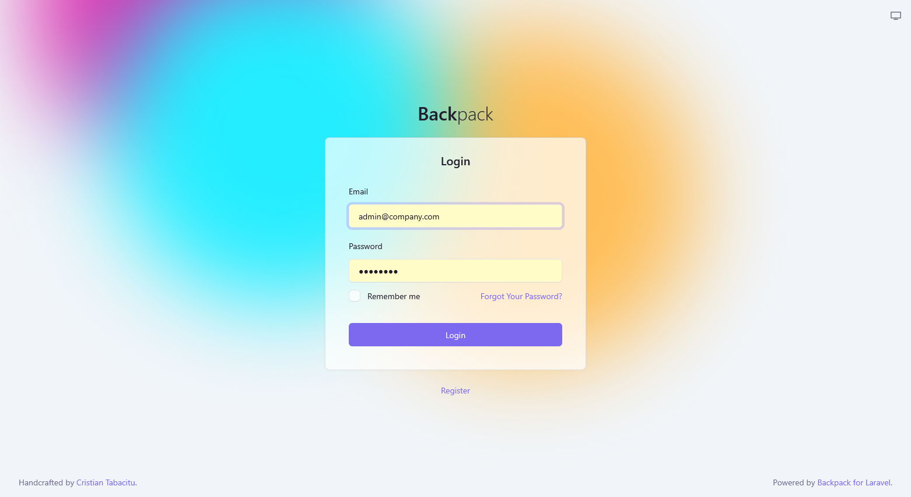
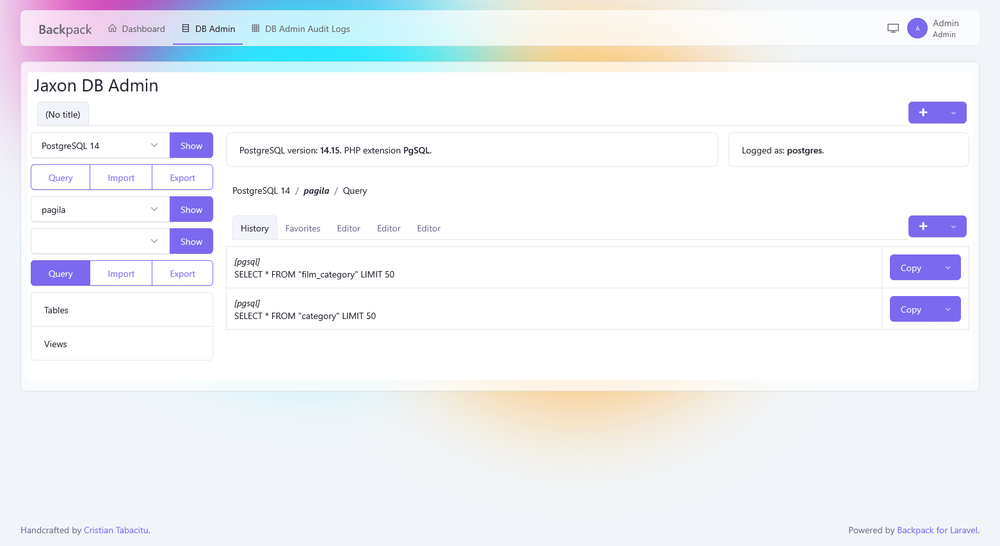

*Note: This blog entry is an update of a [previous article](../../../2025/07/install-jaxon-dbadmin-on-backpack.html) written about how to install the `Jaxon DbAdmin` package in `Backpack`.*
*Meanwhile, a [Backpack addon](https://github.com/lagdo/dbadmin-backpack-addon) was created, making it much more easier to install Jaxon DbAdmin on Backpack.*

*This article describes the installation of the [Jaxon DbAdmin addon](https://github.com/lagdo/dbadmin-backpack-addon) in `Backpack`.*

#### What is Jaxon DbAdmin

`Jaxon DbAdmin` results from the fork and redesign of the [Adminer](https://www.adminer.org/) core features into several [Composer packages](https://github.com/lagdo/dbadmin-mono), and the integration of the [Jaxon library](https://www.jaxon-php.org).

Unlike `Adminer` which is a standalone application, `Jaxon DbAdmin` is a [Jaxon package](../../../../docs/v5x/extensions/packages.html), which allows the user to integrate the database management features into an existing PHP application. Jaxon DbAdmin is therefore available in a page of the application, whose content is updated with ajax requests generated by `Jaxon`.

As an additional consequence, the authentication and security features are not implemented in the package, which will then rely on those provided by the application it is installed on, in the case Backpack and Laravel.

> **Note** While many of its feature are ready for use, Jaxon DbAdmin is still a work in progress, and is not yet ready for production.

#### What is Backpack

[Backpack](https://backpackforlaravel.com) is a flexible admin panel for Laravel, that exists since 2016.
Because it keeps things simple, it is widely regarded as being both easy to learn and easy to customize.

In addition to Laravel, it ships with two themes built on the [Bootstrap 5](https://getbootstrap.com) CSS framework, which is supported by the [UI library](https://github.com/lagdo/ui-builder-bootstrap5) used by `Jaxon DbAdmin`.

#### Install Laravel and Backpack

First, we will install `Backpack` on the version 12 of `Laravel`, [following its documentation](https://backpackforlaravel.com/docs/7.x/installation).

```bash
composer create-project laravel/laravel backpack 12.x
cd backpack
composer require backpack/crud:"^7.0"
```

After we have defined the database access parameters in the `.env` file, we can take the final step of the installation and create an admin account.

```bash
php artisan storage:link
php artisan backpack:install
```

This command will ask for information to create an admin account, and also to choose a theme.
We have chosen [Tabler](https://github.com/laravel-backpack/theme-tabler/), a Bootstrap 5 template.

After the command has completed, we can login on Backpack, and see the application in the `/admin` path.

[](./backpack-login.png)

#### Install the Jaxon DbAdmin addon

The Jaxon DbAdmin addon is available as a Composer package.

```bash
composer require lagdo/dbadmin-backpack-addon
```

If the user needs to enable the audit logs, user query history and favorite features, a migration is provided to create the required tables.
The database connection to be used is set with the Laravel `database.dbadmin` config option.

```bash
php artisan migrate
```

The `php artisan route:list | grep jaxon` command now prints the following line, showing that a route exists for `Jaxon` requests.

```
  POST       jaxon ... (more dots) ... jaxon.ajax
```

The Jaxon DbAdmin addon provides routes, views, middlewares, and all the features needed to integrate Jaxon DbAdmin with Backpack.
Only the menu entry needs to be added manually, by adding the following content in the `resources/views/vendor/backpack/ui/inc/menu_items.blade.php` file.

```php

<li class="nav-item">
  <a class="nav-link" href="{{ backpack_url('dbadmin') }}">
    <i class="la la-database nav-icon"></i> DB Admin
  </a>
</li>

```

If the audit logs feature is enabled (see the `config\dbadmin.php` config file below), a menu item can also be added for its viewer page.

```php

<li class="nav-item">
  <a class="nav-link" href="{{ backpack_url('dbaudit') }}">
    <i class="la la-table nav-icon"></i> DB Admin Audit Logs
  </a>
</li>

```

#### The Jaxon DbAdmin config files

For the Jaxon DbAdmin addon to operate properly, we need to add 3 files in the `config/` dir.

The first is the [Jaxon library](https://www.jaxon-php.org) config file, `config\jaxon.php`.

<script src="https://gist.github.com/feuzeu/8296fc275a6abc777850a0fd712fcdc6.js"></script>

The `app.ui.template` defines the UI library to use, `bootstrap5` here.
The `app.dialogs` section defines the libraries to use for [dialogs](../../../../docs/v5x/ui-features/dialogs.html).
The `provider` option in the `DbAdminPackage` section defines a closure that will load the database servers options from the `config/dbadmin.json` file, whose content is presented below.

The second config file, `config\dbadmin.php`, defines common options for Jaxon DbAdmin.

<script src="https://gist.github.com/feuzeu/7936e968553de224cc9e9fdf91cbef33.js"></script>

In this file, the access to server information and system databases is disabled, the audit logs are enabled, a database connection and the users allowed to view its page are defined.

The last config file, `config\dbadmin.json`, lists the managed database servers, as well as the users access.
Its content then depends on each specific case. Read the `Database access configuration` [section in the documentation](https://github.com/lagdo/dbadmin-app?tab=readme-ov-file#database-access-configuration) to learn more about.

For example, the config file below gives access to the `admin@company.com` user to the four databases created in [this Docker Compose setup](https://github.com/lagdo/dbadmin-mono/blob/main/docker/compose-dbserver/docker-compose.yml).

<script src="https://gist.github.com/feuzeu/e2cf6628a649338953d76df9fd99ff33.js"></script>

The corresponding database credentials are defined in the `.env.dbadmin` file, as follow.

<script src="https://gist.github.com/feuzeu/65e009ae8f635f9d56c4b57b14004d62.js"></script>

The installation of `Jaxon DbAdmin` on `Backpack` has now been completed.
The `admin@company.com` user, once he logs in, can now browse the databases in any of the four configured servers just by choosing one in a dropdown list, in multiple tabs, without entering any database credential.

[](./dbadmin-backpack-tabler-theme.png)

In each database tab, the user can create multiple tabs in the query editor.
If the feature is enabled, the user can browse the executed queries history, label and save its favorite queries, and then copy and paste query text from the history or favorite to any editor tab.

[](./dbadmin-backpack-history.png)

#### Secure the database credentials with Infisical

Jaxon DbAdmin can also read the database credentials from an [Infisical](https://infisical.com) server, instead of the local `.env.dbadmin` file.
It includes by default a custom `config reader` for [Infisical](https://infisical.com), which just needs to be customized.

The [Infisical](https://infisical.com) server setup for Jaxon DbAdmin is described in [this article](../../../2026/01/secure-the-jaxon-dbadmin-database-credentials-with-infisical.html).
The required options are added in the `.env.dbadmin` file, and the database credentials are deleted.

<script src="https://gist.github.com/feuzeu/93f6c4707ef80fff9d691105402b6b79.js"></script>

Finally, the [Infisical](https://infisical.com) `config reader` needs to be provided with a closure which returns the key for any stored secret.

<script src="https://gist.github.com/feuzeu/eaf54ff05b120846449f5ca5319a809b.js"></script>

With this setup, the [Jaxon DbAdmin addon for Backpack](https://github.com/lagdo/dbadmin-backpack-addon) provides the developer using Backpack with a feature-rich and secure but yet simple to use database administration tool, installed in a page of the application.
No need to connect to another page, nor enter or save the database credentials in the browser.
