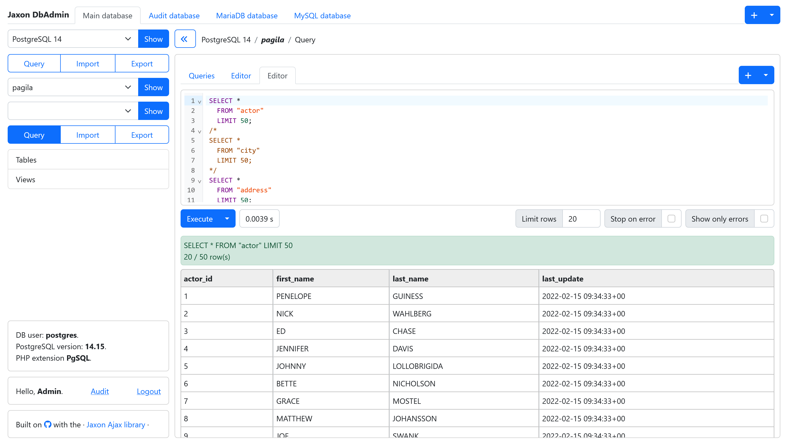
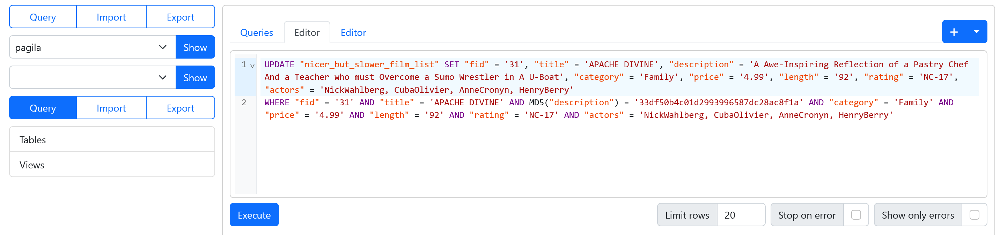
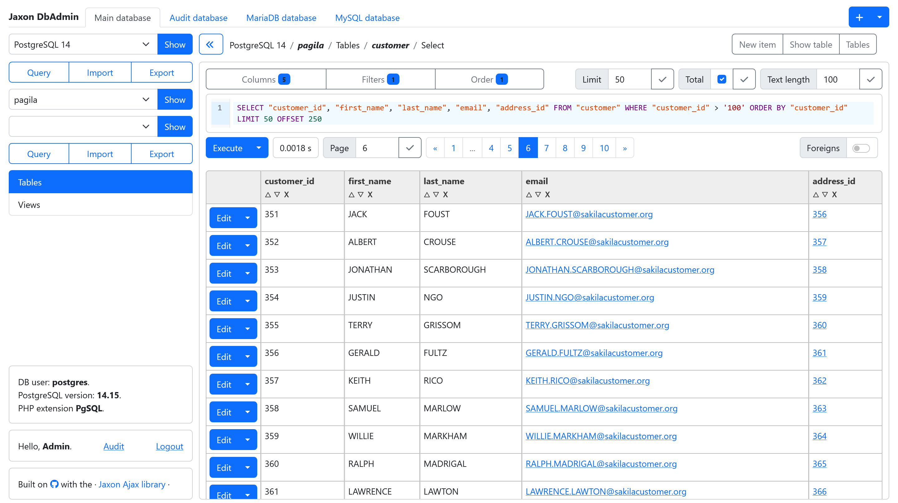
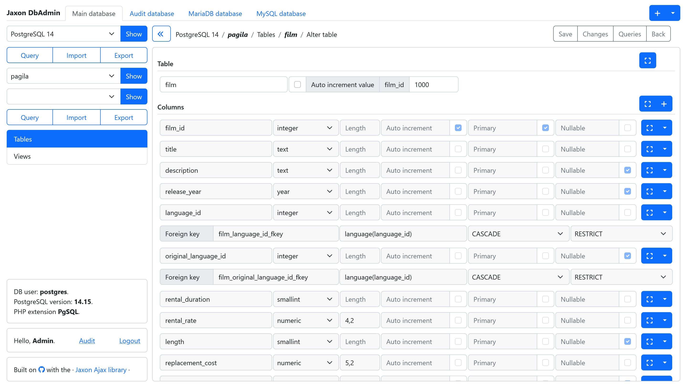
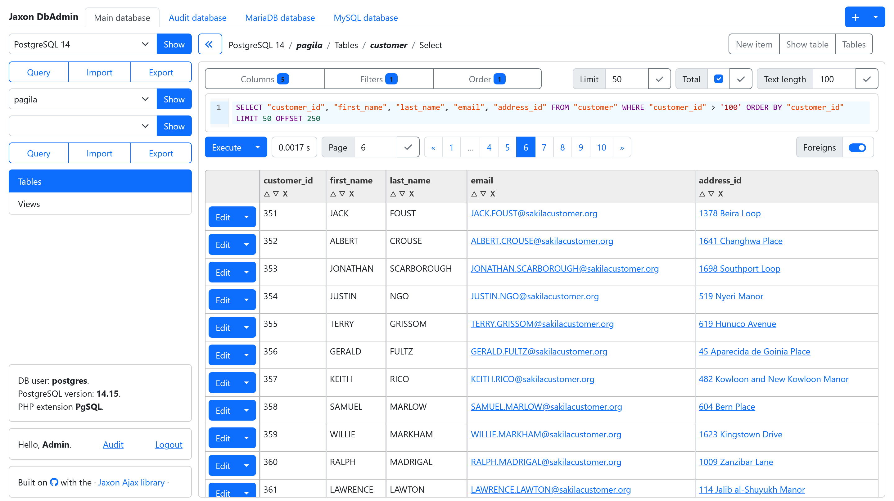
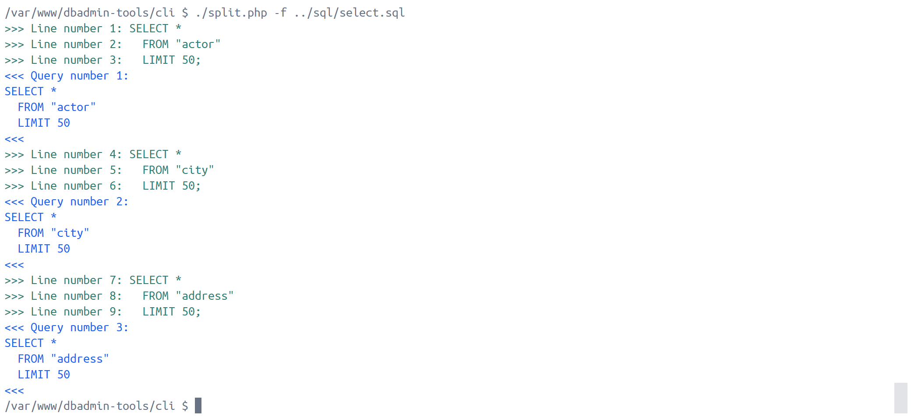
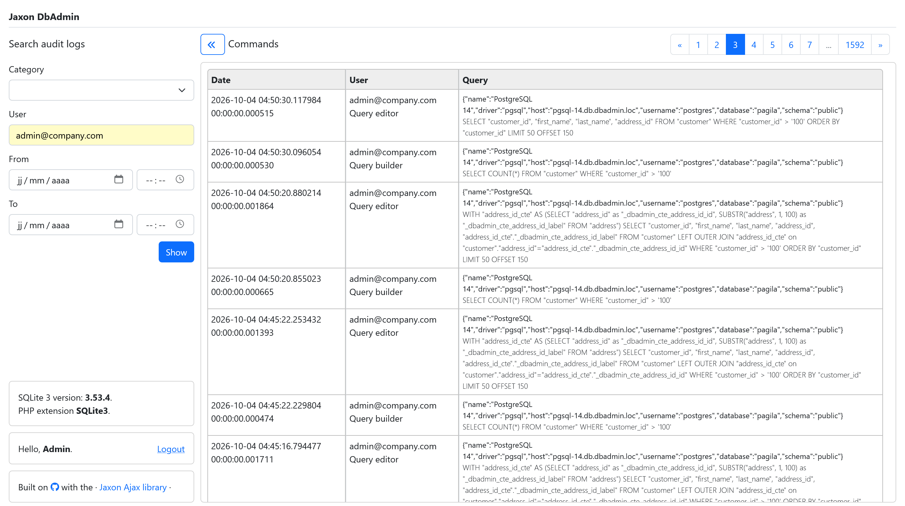

The PHP ecosystem has gifted the IT world with two of the most widely used open-source database management tools: [Adminer](https://adminer.org) and [PhpMyAdmin](https://www.phpmyadmin.net), each having millions of monthly downloads.
However, newer solutions have emerged to provide advanced features that these traditional tools do not natively offer, such as simultaneous multi-database browsing, data masking, advanced users and credentials management, audit logging, and modern UI/UX.
Alternatives like [DBeaver](https://dbeaver.io), [DbGate](https://www.dbgate.io), [ByteBase](https://www.bytebase.com), and the more recent [Tabularis](https://github.com/TabularisDB/tabularis) and [DBx](https://github.com/t8y2/dbx), just to name those with an open source license, deliver these capabilities.
Available as web or desktop applications, their user interfaces are built using modern JavaScript frameworks like React.

Today, the Jaxon DbAdmin web application bridges this gap.
It positions itself as a modern database management tool built with PHP, delivering the same high-level features as the most advanced alternatives on the market.
While the foundational [0.32.0 release](https://github.com/lagdo/jaxon-dbadmin/releases?page=2#release-v0.32.0) introduced an extensive list of changes, fixes, and architectural improvements, subsequent releases have refined the platform.
The features highlighted in this article are available in [version 0.35.1](https://github.com/lagdo/jaxon-dbadmin/releases?page=1#release-v0.35.1), the latest release at the time of writing.
Finally, we will also take a look at the main features planned for upcoming releases.

#### The Jaxon DbAdmin applications

Jaxon DbAdmin is provided as a [Jaxon package](https://www.jaxon-php.org/docs/v5x/extensions/packages.html), which means it implements both the application backend and frontend, and it needs to be installed in an application framework.

>Read the [features and current status](https://github.com/lagdo/jaxon-dbadmin/wiki/01.-Features-and-current-status).

The previous Jaxon DbAdmin releases shipped with a single ready-to-use application built with Laravel.
There are now three of them, respectively built with the [Laravel](https://github.com/lagdo/dbadmin-app-laravel), [Symfony](https://github.com/lagdo/dbadmin-app-symfony) and [Slim](https://github.com/lagdo/dbadmin-app-slim) PHP frameworks.

>Read the [installation documentation](https://github.com/lagdo/jaxon-dbadmin/wiki/02.-Installation).

The user management and authentication feature in Jaxon DbAdmin is provided by the framework it is installed on.
Supporting multiple different frameworks then allows the users to choose their preferred authentication strategy and tools, depending on their needs.
The Laravel, Symfony and Slim frameworks are able to implement various user authentication strategies, from the most simple to the most advanced.

The Jaxon DbAdmin applications include a default authentication feature where the user accounts are stored in a database for Laravel and Symfony, or in a json file for Slim.

>Read the [default authentication documentation](https://github.com/lagdo/jaxon-dbadmin/wiki/05.-Authentication).

Althought they are based on different frameworks, the Jaxon DbAdmin applications share the same configuration options and files.
The config options are separated into three files, `app.php`, `servers.php` and `foreigns.php`.
In the `app.php` and `foreigns.php` config files, some options values are provided as closures or anonymous classes.

The `servers.php` file can also be provided in `json` or `yaml` format. In that case the file is renamed to `servers.json`, `servers.yaml` or `servers.yml`.

>Read the [configuration documentation](https://github.com/lagdo/jaxon-dbadmin/wiki/04.-Configuration-files).

The Jaxon DbAdmin [Docker images](https://hub.docker.com/r/lagdo/jaxon-dbadmin) are also updated, and they are now tagged both with the framework name and their version number. 

#### Database secrets management

The previous releases already allow the users to store their database credentials in a secret management server, instead of the default `.env.dbadmin` file.

The latest release now natively supports 6 secret management services:
  - [Infisical](https://infisical.com/)
  - [AWS Secrets Manager](https://aws.amazon.com/secrets-manager/)
  - [GCP Secret Manager](https://cloud.google.com/security/products/secret-manager)
  - [OpenBao](https://openbao.org) (compatible with [HashiCorp Vault](https://www.hashicorp.com/fr/products/vault))
  - [Azure Key Vault](https://azure.microsoft.com/fr-fr/products/key-vault)
  - [Alibaba Key Management Service](https://www.alibabacloud.com/help/en/kms)

Using a secret manager requires two options in the `app.php` config file.
The `secret.reader` option defines the name of the class implementing the service client, and the `secret.key` defines a class with a function returning the secret location for a given user.

```php
    'secret' => [
        'reader' => Provider\Secret\InfisicalConfigProvider::class,
        'key' => fn() => new class implements Provider\Secret\KeyBuilderInterface {
            public function build(string $prefix, string $option = ''): string
            {
                // $username = Auth::userId(); // Use this to customize the key.
                return "users.{$prefix}.{$option}";
            }
        },
    ],
```

Each secret manager also defines custom options to be provided in the `.env.dbadmin` file, and optionally a procedure to setup the client.
Jaxon DbAdmin will query the secret service for database credentials on each user request, and will never save any secret locally, not even in a cache.

>Read the [secret service configuration](https://github.com/lagdo/jaxon-dbadmin/wiki/08.-Using-a-secret-manager-service).

#### Multi-tab navigation

The list of database servers a Jaxon DbAdmin user can connect to is configured on the server.
That list can be customized for each user, and the servers he is allowed to connect to will be displayed in a dropdown list.

Jaxon DbAdmin allows the user to open multiple tabs, each connected to a chosen database.
Each tab can be renamed, and by default a tab is named after the database it is connected to.
Connecting to a different database automatically rename the tab accordingly.

[](./jaxon-dbadmin-tabs.png)

When connected to a database, the Query Editor window also allows the user to open multiple tabs.
It is convenient when the user needs to run multiple queries on the same database.

The application window and Query Editor tabs can be saved in the user preferences.
They will the be automativally recreated anytime the user opens the application.

#### The Query Editor and Query Builder

Similar to Adminer, Jaxon DbAdmin provides two tools to query database tables: the Query Editor and the Query Builder.

The Query Editor allows the user to manually edit, then execute SQL queries.
As stated earlier, multiple editor tabs can be opened on the same database.
The user can also choose its preferred editor between the [CodeMirror 6](https://codemirror.net) and [Ace](https://ace.c9.io).

[](./jaxon-dbadmin-query-editor.png)

In addition to SQL syntax highlighting and code completion, the Query Editor also provides code completion on the connected database tables and columns names.

The Query Builder is a visual builder for database queries, which support querying and editing table data, and editing table definition.

The Query Builder displays the selected table rows in a paginated list.
Various buttons and dialogs allow the user to select the columns to be displayed, filter rows on column values, and change the results ordering.
The corresponding SQL query is displayed in a read-only field, with syntax highlighting enabled.

[](./jaxon-dbadmin-query-builder-rows.png)

Each data row can be edited in a dialog where each column value is displayed in an HTML input field corresponding to the column type.
The same dialog can be use to insert a new row in the table.

The Query Builder can also display a table definition, in a page with the table columns, indexes, foreign keys and triggers.
From there, the table definition can be altered, in a page that will allow the user to change the table name and properties, and edit, delete or add columns in the table.

[](./jaxon-dbadmin-query-builder-table-edit.png)

When editing row data or table definition, the corresponding SQL query can be displayed for prior validation, and even copied to the Query Editor.

#### The foreign keys

In the paginated list of rows of a table, when a column is a foreign key, each value is displayed in a link.
A click on that link will move the page to the referenced table, and add a filter on the referenced column and value, so only the referenced row is showed.

When a table has one or more foreign keys, a toggle button labelled `Foreigns` is added on the page.
When this button is enabled, the values from the first column with a string type in the referenced table are fetched and displayed instead of the actual column values.

[](./jaxon-dbadmin-query-builder-foreigns.png)

The SQL queries for fetching the referenced values can be customized in the [foreigns.php](https://github.com/lagdo/jaxon-dbadmin/wiki/04.-Configuration-files) config file.

```php
return [
    'dbadmin-mariadb' => [
        'employees' => [
            'employees' => [
                'emp_no' => [
                    'select' => fn(int $textLength) => "SUBSTR(CONCAT(first_name, ' ', last_name), 1, $textLength)",
                    'search' => fn(string $search) => "LOWER(first_name) LIKE $search OR LOWER(last_name) LIKE $search",
                ],
            ],
        ],
    ],
];
```

>Read the [foreign fields documentation](https://github.com/lagdo/jaxon-dbadmin/wiki/09.-Foreign-fields-in-tables).

#### File storage for database import and export

The database import and export function rely on the [FlySystem](https://flysystem.thephpleague.com) package for file storage.
They are then able to store the SQL files on a any of the supported storage types.

The SQL files locations are user dependant, which means a user cannot get access to another user files from his account, event when knowing its name.
This also apply to the file URL for database export. It is valid only for the user who made the export.

>Read the [data import and export documentation](https://github.com/lagdo/jaxon-dbadmin/wiki/10.-Data-import-and-export).

#### Input streaming in database import

Generally, the imported files are loaded into the application memory before the SQL queries they contain are executed.
The application then needs to have enough available memory to be able to store the entire file.
In Adminer for example, the PHP memory limit is updated when processing the imported file.

Jaxon DbAdmin introduces a new Query Processor, with a new file processing model where the file lines are streamed in input, and the corresponding queries are streamed in output.
This results in a dramatic reduction in memory usage, since only a few input lines and a single SQL query are kept in memory at the same same time.

This screenshot shows how the lines stream in and the queries stream out the Query Processor, on a few lines file.

[](./jaxon-dbadmin-query-splitter-cli.png)

While sequential execution within the new Query Processor can increase total execution time, this challenge is easily solved by modern PHP architectures.
By leveraging framework workers, time-consuming queries can be handled asynchronously.
This feature will be introduced in an upcoming release.

#### Audit logging

Jaxon DbAdmin can be configured to save all the executed queries in a dedicated database.
These queries can then be visualised in a separate audit logging page with limited access.

[](./jaxon-dbadmin-audit-logging.png)

The latest releases feature an extension of the data Jaxon DbAdmin records in the audit logs.
They now include the client IP, the user agent, and generated ids for the HTTP session and request, the database driver and options, the query code, result, timestamp and duration, the error code and message when the query execution fails, the number of returned or affected rows when the query execution succeeds, and of course, the user who executed the query.

>Note: some of the fields still need to be filled or displayed in the audit logs page.

### The new application architecture

Although running behind the scenes, the new application architecture is the foundation designed to make the implementation of all other features both simple and reliable.

#### The database drivers

Since its early releases, the database features are implemented in separate packages:
- [https://github.com/lagdo/dbadmin-driver](https://github.com/lagdo/dbadmin-driver): common classes and interfaces for the database drivers.
- [https://github.com/lagdo/dbadmin-driver-pgsql](https://github.com/lagdo/dbadmin-driver-pgsql): the database driver for PostgreSQL.
- [https://github.com/lagdo/dbadmin-driver-mysql](https://github.com/lagdo/dbadmin-driver-mysql): the database driver for MySQL and MariaDB.
- [https://github.com/lagdo/dbadmin-driver-sqlite](https://github.com/lagdo/dbadmin-driver-sqlite): the database driver for SQLite.

Today, the drivers have evolved to a simpler model where their features are separated into query generation and query execution.
The query execution part takes a raw query as input, passes it to the database server, and, depending on the query type and the execution results, returns the appropriate set of data.

With the exception of a few specific cases, the DDL, DML and DQL functions now generate and return a set of SQL queries, which will then be executed in a separate call.
Prior to execution, the generated query can be presented to the user for validation, editing, or even storage for future reuse.

The usage of DTOs has also been generalized. Instead of arrays or strings, the drivers functions now receive DTOs as input and returns other DTOs as output.

As stated before, the database features come from Adminer. It means that the actual calls to the database servers, for example to read the list of tables in a database, still run code inherited from Adminer.
That code is eventually improved to adapt PHP 8 changes, and return data in DTOs instead of arrays.

#### The database support layer

On top of the database drivers, a pluggable support layer is introduced, with many new features.
The timer for query duration computation and audit logs storage are modules that are plugged into the driver proxy, and automatically called before and after every query execution.
They take the query SQL code and results as parameters.

In addition to the drivers DTOs, another set of DTOs is provided to carry the data between the UI components and the driver.
So a database function now takes the user data as input in a UI DTO, converts it to a driver DTO, calls one or more driver functions, and converts the output to another set of UI DTOs.
As a result, from the UI to the driver, every Jaxon DbAdmin feature processes well-defined and strongly-typed data structures, which significantly boosts reliability.

At the core of the query execution feature, a new QueryProcessor class is introduced, serving as the only interface for query execution.
It takes a set of queries in a DTO as input, calls the driver functions, and returns the results as a set of DTOs.
It also accepts options allowing callers to decide whether to log queries or compute execution duration.
In such cases, the corresponding features are enabled in the classes where they are implemented.

Another notable change is the QueryStream class, which allows the database import feature to stream uploaded file lines instead of loading them all at once into memory.

### Oncoming features

#### AI assistant

The AI assistant is on top of the next releases feature list.
Two interaction modes are planned. The `Ask mode` where the AI assistant can suggest SQL queries without actually executing any of them, and the `Agent mode` where it can also execute queries.

The Jaxon DbAdmin drivers are able to return detailed data about the database tables and columns.
Combined with the Query Processor unique features, there form a solid basis for the AI assistant implementation.

#### Enhanced query builder

Currently, the Query Builder builds select queries only for a single table.
In the future releases, it will be able to query multiple tables with joins, and convert complex select queries from SQL code to its internal data structure.

#### UI templates

The application UI is built with the [UI Builder](https://github.com/lagdo/ui-builder) library, and the open source [SbAdmin template](https://github.com/startbootstrap/startbootstrap-sb-admin).
Other CSS frameworks are planned to be supported by the [UI Builder](https://github.com/lagdo/ui-builder) library, including TailwindCSS and Bulma.
So in addition to Bootstrap 5, other templates based on these frameworks will be available in the future releases.

Integrating a new admin dashboard is easy, since it doesn't require any changes to the application UI components code.

### Closing thoughts

The latest releases of Jaxon DbAdmin introduce an extensive array of new features and improvements.
On top of the existing database driver packages, a new engine for query generation and execution has been deployed, boosting reliability thanks to the use of DTOs.
On the UI/UX front, the usability of every function has been significantly enhanced.

With its current roadmap, Jaxon DbAdmin will soon match the feature set of the market's most advanced solutions, such as [DBeaver](https://dbeaver.io), [DbGate](https://www.dbgate.io), [ByteBase](https://www.bytebase.com), and the more recent [Tabularis](https://github.com/TabularisDB/tabularis) and [DBx](https://github.com/t8y2/dbx).
It will even offer a superior alternative in certain areas, such as its database credentials management and native support for multiple secret managers.
While alternative tools often restrict advanced features to paid plans, Jaxon DbAdmin offers all its functionalities completely for free.

Unlike these desktop-centric alternatives, Jaxon DbAdmin is a pure web application written in PHP, like [Adminer](https://adminer.org) and [PhpMyAdmin](https://www.phpmyadmin.net).
It therefore combines the security and centralized advantages of a server-side web application with the usability of a desktop client.
