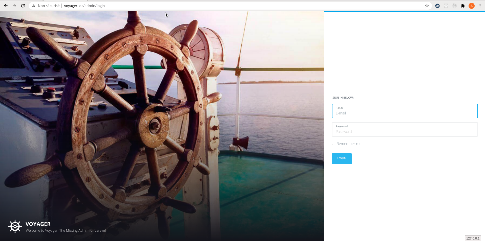
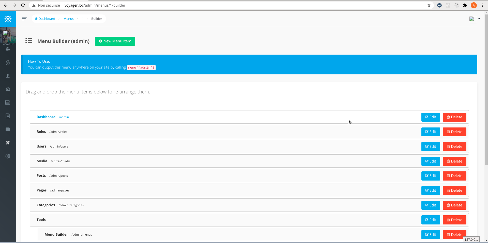
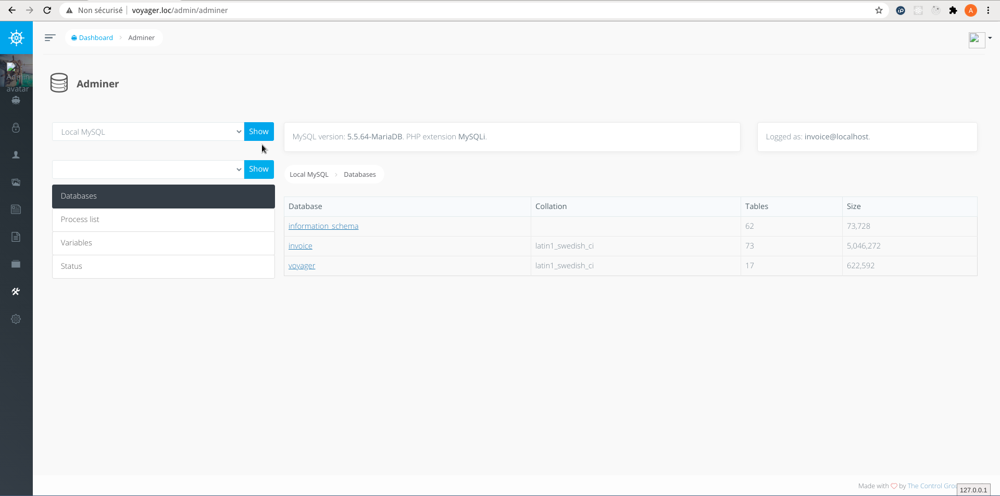

*Note: This blog entry is an update of a [previous article](../../../2021/03/install-jaxon-adminer-on-voyager.html) we wrote about how to install the `Jaxon Adminer` package on `Voyager`.*
*Meanwhile, the new [Jaxon DbAdmin](https://github.com/lagdo/jaxon-dbadmin) package was created, and the database drivers and UI builders were moved to separate packages.*

*This article describes the installation of these new packages.*

The two most popular PHP web applications for database administration are [phpMyAdmin](https://www.phpmyadmin.net/) and [Adminer](https://www.adminer.org/). Both are standalone applications that need to be installed on a web server.

The Jaxon packages offer another choice, [Jaxon DbAdmin](https://github.com/lagdo/jaxon-dbadmin), which inserts a database administration tool in a page of an existing PHP web application.
This solution relies on [Adminer](https://www.adminer.org/), and will thus offer the same features.

#### What is Adminer

[Adminer](https://www.adminer.org/) (formerly phpMinAdmin) is a full-featured database management tool written in PHP. Conversely to phpMyAdmin, it consist of a single file ready to deploy to the target server. `Adminer` is available for `MySQL`, `MariaDB`, `PostgreSQL`, `SQLite`, `MS SQL`, `Oracle`, `Elasticsearch`, `MongoDB` and others via plugin.

#### What is Jaxon DbAdmin

Conversely to `Adminer` which is a standalone application, `Jaxon DbAdmin` is a [package](../../../../docs/v3x/plugins/packages.html) which allows the user to integrate the `Adminer` features into an existing PHP application. They are then available in a page of the application, whose content is updated with ajax requests generated by `Jaxon`.
As a consequence, the access management features (authentication and security) are removed from the package, which will then rely on those provided by the application it is installed on.

#### What is Voyager

Sometimes a user may not have a PHP web application available for integrating `Jaxon DbAdmin`.
He then needs to install a complete application from scratch.
In this case, it is possible to integrate `Jaxon DbAdmin` in one of the numerous PHP backend administration packages available.

In this article, we have chosen [Voyager](https://voyager-docs.devdojo.com), because it is free, it is built on the [Laravel](https://laravel.com) framework for which a [Jaxon plugin](https://github.com/jaxon-php/jaxon-laravel) exists, and it is built on the [Bootstrap 3](https://getbootstrap.com/docs/3.4/) CSS framework, which is supported by  `Jaxon DbAdmin`.

#### Install Laravel and Voyager

Althougth this article describes the installation of `Jaxon DbAdmin` on `Voyager`, the main steps are the same for the installation on others environments.
1. Install `Jaxon` packages,
2. Create the page that will display the `Jaxon DbAdmin` dashboard,
3. Add a route and a menu entry for this page,
4. Configure `Jaxon` and its packages, among which `Jaxon DbAdmin`.

Fisrt, we will install `Voyager` on the version 9 of `Laravel`, [following its documentation](https://voyager-docs.devdojo.com/getting-started/installation).
```bash
composer create-project laravel/laravel voyager 9.x
cd voyager
composer require tcg/voyager
```

After we have defined the database access parameters in the `.env` file, we can take the final step of the installation and create an admin account.
```bash
php artisan voyager:install
php artisan voyager:admin your@email.com --create
```

We can now login on `Voyager`, on the `/admin` path in the installed application.

[](./voyager-login.png)

#### Install Jaxon packages

In addition to the `lagdo/jaxon-dbadmin` package, we need to install the `jaxon-php/jaxon-laravel` package, for integration with `Laravel`, the framework `Voyager` is built with.

For the database drivers, we need to install the `lagdo/dbadmin-driver-mysql`, `lagdo/dbadmin-driver-pgsql` or `lagdo/dbadmin-driver-sqlite` packages, depending on the databases that need to be managed.

Finally, we need to install packages for the UI. At the time this article is published, only the [package for `Bootstrap`](https://github.com/lagdo/ui-builder-bootstrap) is available.

```bash
composer require lagdo/jaxon-dbadmin jaxon-php/jaxon-laravel
composer require lagdo/dbadmin-driver-mysql lagdo/dbadmin-driver-pgsql lagdo/dbadmin-driver-sqlite
composer require lagdo/ui-builder-bootstrap
```

The `php artisan route:list | grep jaxon` command now prints the following lines, showing that a route exists for `Jaxon` requests.
```
| Domain | Method | URI     | Name    | Action                                                     | Middleware
+--------+--------+---------+---------+------------------------------------------------------------+-----------
|        | POST   | jaxon   | jaxon   | Jaxon\Laravel\Http\Controllers\JaxonController@process     | web
```

#### Create a page for Jaxon DbAdmin

We are now going to add a `Laravel` controller, a view and a route that will display the `Jaxon DbAdmin` page.

The `app/Http/Controllers/JaxonController.php` controller shows the view, with the HTML, CSS and javascript codes of `Jaxon DbAdmin` as parameters.
The controller also calls the `ready()` method of the `Jaxon DbAdmin` package, to tell `Jaxon` that the package must be initialized when showing this page.
```php
namespace App\Http\Controllers;

use Jaxon\Laravel\Jaxon;
use Lagdo\DbAdmin\Package as DbAdmin;

class JaxonController extends Controller
{
    public function dbadmin(Jaxon $jaxon)
    {
        // Set the DbAdmin package as ready
        $dbadmin = $jaxon->package(DbAdmin::class);
        $dbadmin->ready();

        // Print the page
        return view('dbadmin', [
            'jaxonCss' => $jaxon->css(),
            'jaxonJs' => $jaxon->js(),
            'jaxonScript' => $jaxon->script(),
            'pageTitle' => "DbAdmin",
            // DbAdmin home
            'pageContent' => $dbadmin->getHtml(),
        ]);
    }
}
```

The `resources/views/dbadmin.blade.php` view extends the `voyager:master` template, and insert the HTML, CSS and javascript codes of `Jaxon DbAdmin` in the page.


[//]: <> (The raw command prevents the interpretation of tags {{ and }} in the code, which makes Grav to crash.)
```php
@extends('voyager::master')

@section('page_title', $pageTitle)

@section('css')
    <meta name="csrf-token" content="{{ csrf_token() }}">
{!! $jaxonCss !!}
@stop

@section('page_header')
    <h1 class="page-title"><i class="voyager-data"></i>{{ $pageTitle }}</h1>
@stop

@section('content')
    <div class="page-content container-fluid">
{!! $pageContent !!}
    </div>
@stop

@section('javascript')
    <script>
        $('document').ready(function () {
            $('.toggleswitch').bootstrapToggle();
        });
    </script>
{!! $jaxonJs !!}
{!! $jaxonScript !!}
@stop
```


The route is defined right after those of `Voyager`, with the middleware provided by `Voyager`.

```php
use App\Http\Controllers\JaxonController;

Route::group(['prefix' => 'admin'], function () {
    Voyager::routes();
    Route::get('/dbadmin', JaxonController::class . '@dbadmin')
        ->name('jaxon.dbadmin')->middleware('admin.user');
});
```

The name of this route will be used in the `Menu Builder` in `Voyager`, as described in the next paragraph.

#### Create a menu entry for DbAdmin in Voyager

`Voyager` comes with a `Menu Builder`, which we will now use to create a menu entry for `DbAdmin`.
It launches from the `Tools > Menu Builder` menu entry. The `Builder` button in the `admin` list item then shows the above page, where the menu entries are defined.

[](./voyager-menu-builder.png)

From the `New Menu Item` button, we now add a new menu entry with the following attributes:
- Title: DbAdmin
- Type: Dynamic Route
- Route: jaxon.dbadmin
- Route parameters: (empty)
- Icon: voyager-data

We can then move the menu entry anywhere we want, for example under the `Tools` section.

After reloading the `Menu Builder` page, the `/admin/dbadmin` link now appears in the `DbAdmin` menu entry.

[](./voyager-menu-dbadmin.png)

#### Jaxon configuration

The `config\jaxon.php` file defines the configuration of the `Jaxon` library, and all its plugins and packages.

```php
return [
    'app' => [
        'packages' => [
            Lagdo\DbAdmin\Package::class => [
                'template' => 'bootstrap3',
                'servers' => [
                    'local' => [
                        'name' => 'Local MySQL',
                        'driver' => 'mysql',
                        'host' => env('DB_HOST'),
                        'port' => env('DB_PORT'),
                        'username' => env('DB_USERNAME'),
                        'password' => env('DB_PASSWORD'),
                    ],
                ],
                'default' => 'local',
            ],
        ],
    ],
    'lib' => [
        'core' => [
            'language' => 'en',
            'encoding' => 'UTF-8',
            'request' => [
                'csrf_meta' => 'csrf-token',
            ],
            'prefix' => [
                'class' => '',
            ],
            'debug' => [
                'on' => false,
                'verbose' => false,
            ],
            'error' => [
                'handle' => false,
            ],
        ],
        'js' => [
            'lib' => [
                // 'uri' => '/jaxon/lib',
            ],
            'app' => [
                // 'uri' => '',
                // 'dir' => '',
                'export' => false,
                'minify' => false,
            ],
        ],
        'dialogs' => [
            'default' => [
                'modal' => 'bootstrap',
                'message' => 'noty',
                'question' => 'noty',
            ],
            'toastr' => [
                'options' => [
                    'closeButton' => true,
                    'positionClass' => 'toast-top-center'
                ],
            ],
            'assets' => [
                'include' => [
                    'all' => true,
                ],
            ],
        ],
    ],
];
```

The `lib.core.request.csrf_meta` option adds [Laravel CSRF protection](https://laravel.com/docs/8.x/csrf) on `Jaxon` requests.

The `lib.dialogs` section defines the parameters of the [jaxon-dialogs](https://github.com/jaxon-php/jaxon-dialogs) package.

The `servers` option in the `app.packages.Lagdo\DbAdmin\Package` section defines the list of servers to be managed.
In this case, `DbAdmin` only manage the server on which the `Voyager` database is created.
The `default` option indicates a default server on which to connect when the `DbAdmin` page is loaded.

The installation of `Jaxon DbAdmin` on `Voyager` is now complete.
The above image shows how the page is displayed to the user.

[](./voyager-dbadmin-server.png)

The user can for example browse the content of the `Voyager` database.

[](./voyager-dbadmin-database.png)
